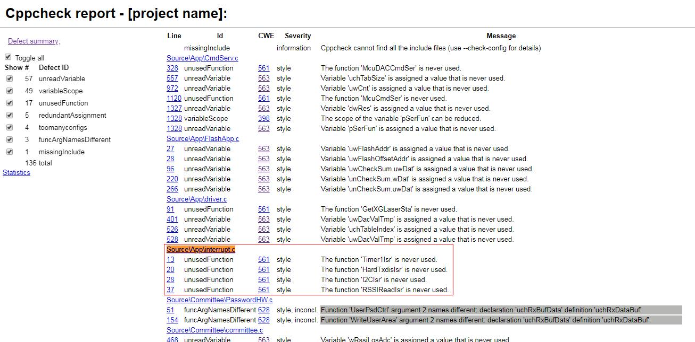

CppCheck部署
===================

cppcheck 下载安装
----------------------

官网地址：http://cppcheck.net/

1. 这里下载Windows 64-bit安装包, 下载下来后直接点击安装, 安装完成后在C:\Program Files\Cppcheck目录下.

2. 将C:\Program Files\Cppcheck路径加到PATH环境变量.

3. Windows的安装包中没有htmlreport目录, 可以下载Source code (.zip), 解压后将htmlreport拷贝到C:\Program Files\Cppcheck下.

文件解析
------------

1. 在cmd中进入到要检查的代码路径, 执行以下命令

.. code-block:: sh

    # %src_path% 要检查的代码路径
    cppcheck.exe --enable=all --inconclusive --xml --xml-version=2 %src_path% 2> cppcheck.xml
    # 生成html报告
    python "C:\Program Files\Cppcheck\htmlreport\cppcheck-htmlreport" --file cppcheck.xml --source-encoding="iso8859-1" --report-dir=test --source-dir=%src_path%

排除误报项
--------------

如图所示, 中断文件Source\App\interrupt.c中的中断函数是通过硬件调用的, 没有C文件直接调用, 工具检查出来全部是unusedFunction, 属于误报: 需要排除.

增加配置文件suppressions.txt, 文件内容如下

.. code-block:: sh

    unusedFunction:Source\App\interrupt.c
    
cppcheck.exe命令中增加--suppressions-list=suppressions.txt选项即可

.. code-block:: sh

    cppcheck.exe --enable=all --suppressions-list=suppressions.txt --inconclusive --xml --xml-version=2 %src_path% 2> cppcheck.xml
