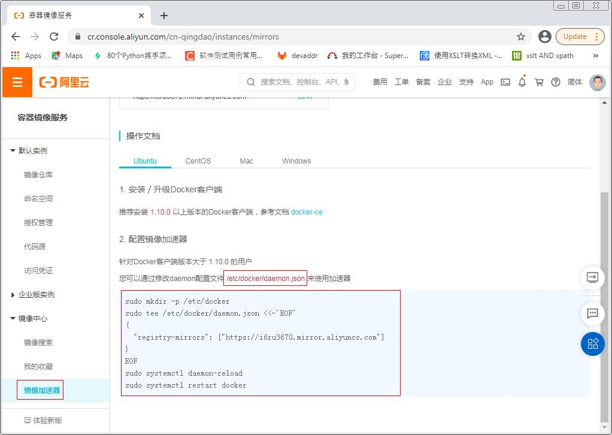
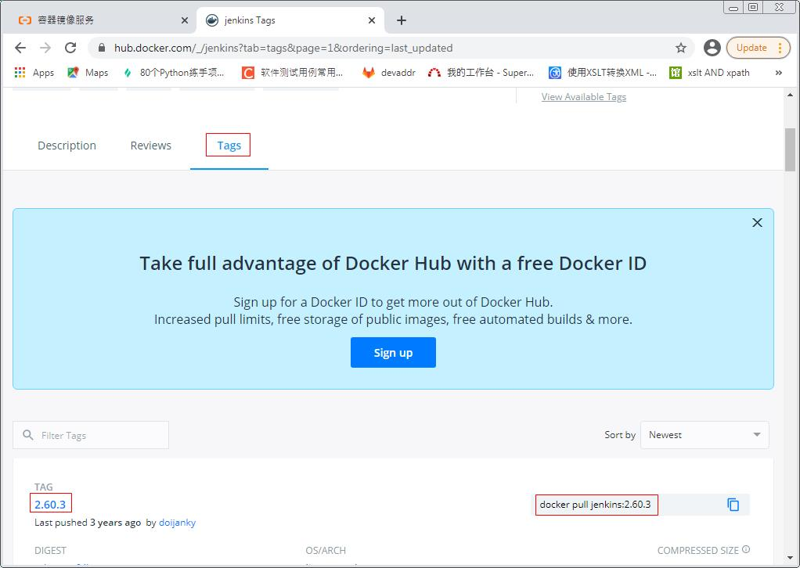
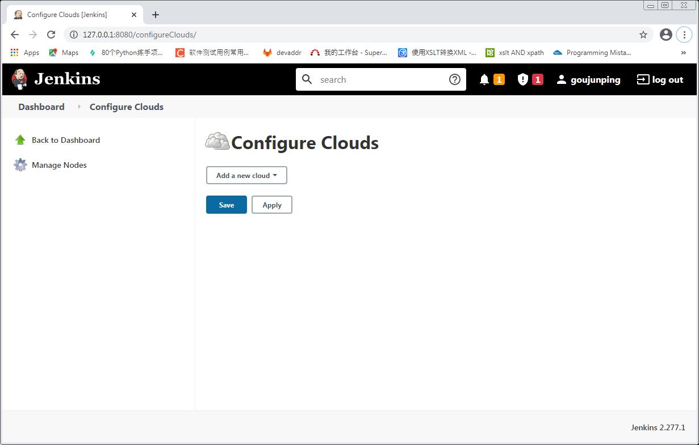
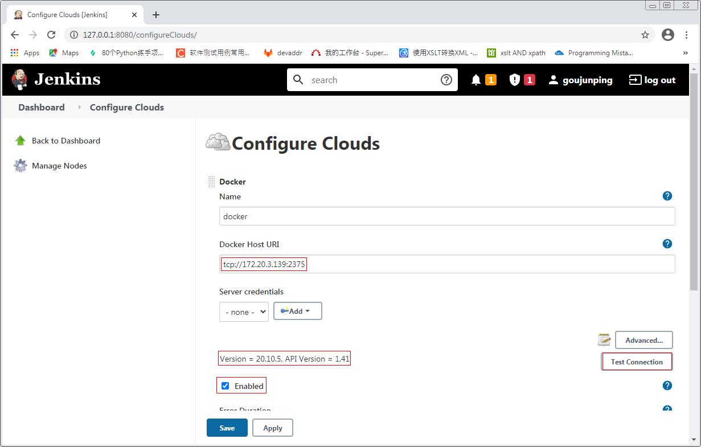
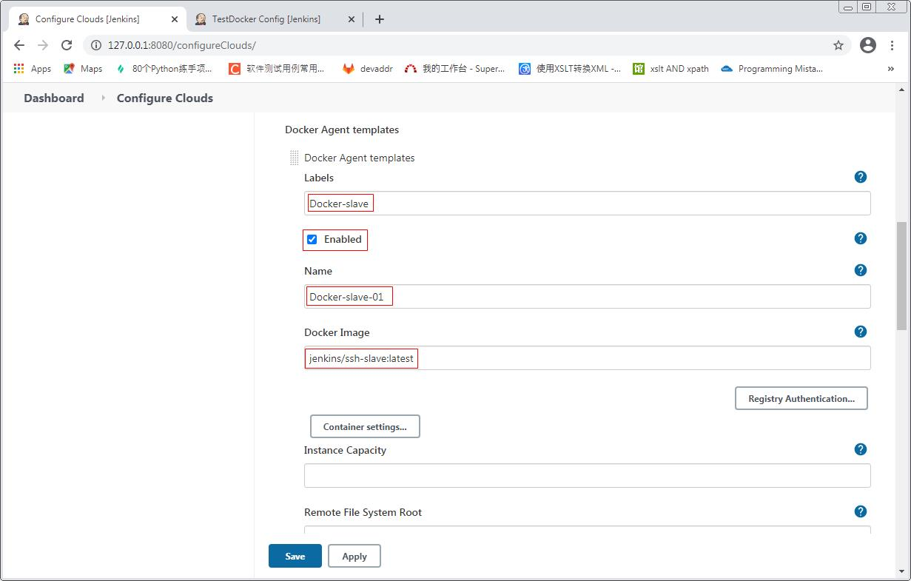
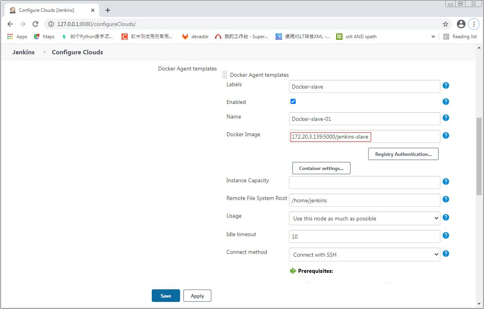
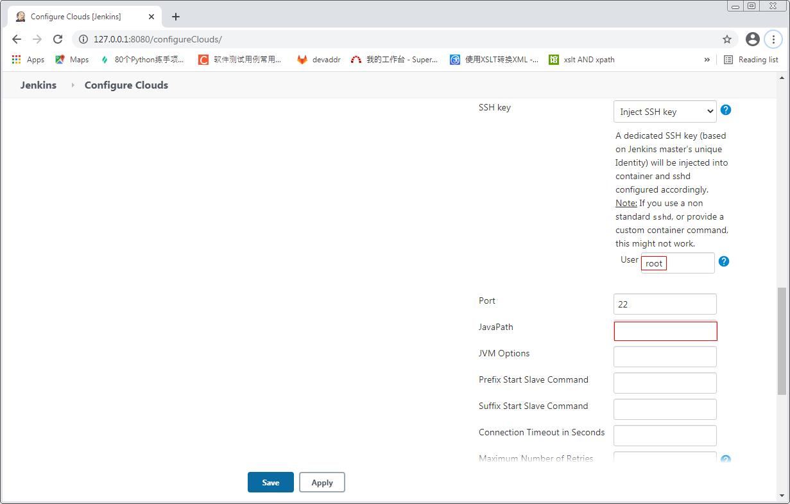

# Docker环境搭建

### Docker安装

系统: Centos7

1. 安装依赖库

    ```Shell
    yum install -y yum-utils device-mapper-persistent-data lvm2
    ```
  
2. 安装docker仓库

    ```Shell
    sudo yum-config-manager --add-repo https://download.docker.com/linux/centos/docker-ce.repo
    ```

3. 更新yum包索引

    ```Shell
    yum makecache fast
    ```

4. 安装最新版本的Docker CE

    ```Shell
    yum install docker-ce
    ```

5. Docker版本查看

    ```Shell
    [root@localhost opt]# docker version
    Client: Docker Engine - Community
     Version:           20.10.5
     API version:       1.41
     Go version:        go1.13.15
     Git commit:        55c4c88
     Built:             Tue Mar  2 20:33:55 2021
     OS/Arch:           linux/amd64
     Context:           default
     Experimental:      true

    Server: Docker Engine - Community
     Engine:
      Version:          20.10.5
      API version:      1.41 (minimum version 1.12)
      Go version:       go1.13.15
      Git commit:       363e9a8
      Built:            Tue Mar  2 20:32:17 2021
      OS/Arch:          linux/amd64
      Experimental:     false
     containerd:
      Version:          1.4.3
      GitCommit:        269548fa27e0089a8b8278fc4fc781d7f65a939b
     runc:
      Version:          1.0.0-rc92
      GitCommit:        ff819c7e9184c13b7c2607fe6c30ae19403a7aff
     docker-init:
      Version:          0.19.0
      GitCommit:        de40ad0
    [root@localhost opt]#
    ```

6. Docker卸载

    ```Shell
    [root@localhost ~]# yum remove docker docker-common docker-selinux docker-engine docker-ce-cli
    Loaded plugins: fastestmirror, langpacks
    No Match for argument: docker
    No Match for argument: docker-common
    No Match for argument: docker-engine
    Resolving Dependencies
    --> Running transaction check
    ---> Package container-selinux.noarch 2:2.119.2-1.911c772.el7_8 will be erased
    --> Processing Dependency: container-selinux >= 2:2.74 for package: containerd.io-1.4.4-3.1.el7.x86_64
    --> Processing Dependency: container-selinux >= 2:2.74 for package: 3:docker-ce-20.10.5-3.el7.x86_64
    --> Running transaction check
    ---> Package containerd.io.x86_64 0:1.4.4-3.1.el7 will be erased
    ---> Package docker-ce.x86_64 3:20.10.5-3.el7 will be erased
    --> Processing Dependency: docker-ce for package: docker-ce-rootless-extras-20.10.5-3.el7.x86_64
    --> Running transaction check
    ---> Package docker-ce-rootless-extras.x86_64 0:20.10.5-3.el7 will be erased
    --> Finished Dependency Resolution
    extras/7/x86_64                                                                                                                              | 2.9 kB  00:00:00
    mysql-connectors-community/x86_64                                                                                                            | 2.6 kB  00:00:00
    mysql-tools-community/x86_64                                                                                                                 | 2.6 kB  00:00:00
    mysql56-community/x86_64                                                                                                                     | 2.6 kB  00:00:00
    nux-dextop/x86_64                                                                                                                            | 2.9 kB  00:00:01
    updates/7/x86_64                                                                                                                             | 2.9 kB  00:00:00

    Dependencies Resolved

    ====================================================================================================================================================================
     Package                                       Arch                       Version                                       Repository                             Size
    ====================================================================================================================================================================
    Removing:
     container-selinux                             noarch                     2:2.119.2-1.911c772.el7_8                     @extras                                41 k
    Removing for dependencies:
     containerd.io                                 x86_64                     1.4.4-3.1.el7                                 @docker-ce-stable                     128 M
     docker-ce                                     x86_64                     3:20.10.5-3.el7                               @docker-ce-stable                     115 M
     docker-ce-rootless-extras                     x86_64                     20.10.5-3.el7                                 @docker-ce-stable                      24 M

    Transaction Summary
    ====================================================================================================================================================================
    Remove  1 Package (+3 Dependent packages)

    Installed size: 268 M
    Is this ok [y/N]: y
    Downloading packages:
    Running transaction check
    Running transaction test
    Transaction test succeeded
    Running transaction
      Erasing    : docker-ce-rootless-extras-20.10.5-3.el7.x86_64                                                                                                   1/4
      Erasing    : 3:docker-ce-20.10.5-3.el7.x86_64                                                                                                                 2/4
      Erasing    : containerd.io-1.4.4-3.1.el7.x86_64                                                                                                               3/4
      Erasing    : 2:container-selinux-2.119.2-1.911c772.el7_8.noarch                                                                                               4/4
      Verifying  : containerd.io-1.4.4-3.1.el7.x86_64                                                                                                               1/4
      Verifying  : 3:docker-ce-20.10.5-3.el7.x86_64                                                                                                                 2/4
      Verifying  : docker-ce-rootless-extras-20.10.5-3.el7.x86_64                                                                                                   3/4
      Verifying  : 2:container-selinux-2.119.2-1.911c772.el7_8.noarch                                                                                               4/4

    Removed:
      container-selinux.noarch 2:2.119.2-1.911c772.el7_8

    Dependency Removed:
      containerd.io.x86_64 0:1.4.4-3.1.el7               docker-ce.x86_64 3:20.10.5-3.el7               docker-ce-rootless-extras.x86_64 0:20.10.5-3.el7

    Complete!
    [root@localhost ~]# rm -rf /var/lib/docker
    [root@localhost ~]# rm -f /etc/docker/daemon.json
    [root@localhost ~]# rm -f /usr/lib/systemd/system/docker.service
    ```

### Docker配置

1. 加速器配置: 阿里云为例, https://cr.console.aliyun.com/cn-qingdao/instances/mirrors

    

2. 下载镜像: 以Jenkins镜像为例

    镜像搜索:
    
    
    
    因为Jenkins镜像没有latest版本, 所以在pull的时候需要跟tag号
    
    

    ```Shell
    [root@localhost opt]# docker pull jenkins:2.60.3
    2.60.3: Pulling from library/jenkins
    55cbf04beb70: Pull complete
    1607093a898c: Pull complete
    9a8ea045c926: Pull complete
    d4eee24d4dac: Pull complete
    c58988e753d7: Pull complete
    794a04897db9: Pull complete
    70fcfa476f73: Pull complete
    0539c80a02be: Pull complete
    54fefc6dcf80: Pull complete
    911bc90e47a8: Pull complete
    38430d93efed: Pull complete
    7e46ccda148a: Pull complete
    c0cbcb5ac747: Pull complete
    35ade7a86a8e: Pull complete
    aa433a6a56b1: Pull complete
    841c1dd38d62: Pull complete
    b865dcb08714: Pull complete
    5a3779030005: Pull complete
    12b47c68955c: Pull complete
    1322ea3e7bfd: Pull complete
    Digest: sha256:eeb4850eb65f2d92500e421b430ed1ec58a7ac909e91f518926e02473904f668
    Status: Downloaded newer image for jenkins:2.60.3
    docker.io/library/jenkins:2.60.3
    [root@localhost opt]#
    [root@localhost opt]# docker images
    REPOSITORY    TAG       IMAGE ID       CREATED         SIZE
    hello-world   latest    bf756fb1ae65   14 months ago   13.3kB
    jenkins       2.60.3    cd14cecfdb3a   2 years ago     696MB
    [root@localhost opt]#
    ```

### Docker常用命令

1. **docker images**: 查看已安装的docker镜像

2. **docker image rm <imageID>**: 删除镜像

3. **docker pull [OPTIONS] NAME[:TAG|@DIGEST]**: 获取镜像

4. **docker search**: 从仓库搜索镜像

5. **docker exec –it <containerID> bash**: 进入docker容器内部

6. **docker run**: 运行docker镜像

7. **docker ps**: 查看运行容器进程

8. **docker run –d**: 在后台运行docker镜像

9. **docker run –p 3306:3306**: 端口映射

10. **docker stop <containerID>**：停止正在运行的容器

### 将容器中的数据目录挂载到宿主机

以Jenkins镜像为例

1. 启动Jenkins镜像

    ```Shell
    [root@localhost local]# docker run -d --name jenkins -p 8080:8080 -p 50000:50000 jenkins:2.60.3
    825cd4485f22ac775f224dbbc4cab69b59b79cb812ed511bdb318f6ab7f9233f
    [root@localhost local]#
    ```
    
2. 将容器中的/var/jenkins_home/userContent目录复制到宿主机中/usr/local/jenkins/userContent

    ```Shell
    [root@localhost local]# mkdir /usr/local/jenkins
    [root@localhost local]# docker cp jenkins:/var/jenkins_home/userContent /usr/local/jenkins/userContent
    [root@localhost local]# ls -al /usr/local/jenkins/
    total 0
    drwxr-xr-x   3 root root  25 Mar 10 10:20 .
    drwxr-xr-x. 13 root root 146 Mar 10 10:19 ..
    drwxr-xr-x   2 root root  24 Mar 10 10:14 userContent
    [root@localhost local]# 
    ```

3. 停止前面运行的容器

    ```Shell
    [root@localhost local]# docker ps
    CONTAINER ID   IMAGE            COMMAND                  CREATED         STATUS         PORTS                                              NAMES
    825cd4485f22   jenkins:2.60.3   "/bin/tini -- /usr/l…"   8 minutes ago   Up 8 minutes   0.0.0.0:8080->8080/tcp, 0.0.0.0:50000->50000/tcp   jenkins
    [root@localhost local]# docker stop 825cd4485f22
    825cd4485f22
    [root@localhost local]#
    ```

4. 再次运行容器, 添加挂载命令

    ```Shell
    [root@localhost local]# docker run -d --name jenkins -p 8080:8080 -p 50000:50000 -v /usr/local/jenkins/userContent:/var/jenkins_home/userContent jenkins:2.60.3
    docker: Error response from daemon: Conflict. The container name "/jenkins" is already in use by container "825cd4485f22ac775f224dbbc4cab69b59b79cb812ed511bdb318f6ab7f9233f". You have to remove (or rename) that container to be able to reuse that name.
    See 'docker run --help'.
    [root@localhost local]# docker rm -f jenkins
    jenkins
    [root@localhost local]#
    [root@localhost local]#
    [root@localhost local]# docker run -d --name jenkins -p 8080:8080 -p 50000:50000 -v /usr/local/jenkins/userContent:/var/jenkins_home/userContent jenkins:2.60.3
    17755738c01e84d00ac25eeee06582111e52f8a2f283deb068aa92b827fd7535
    [root@localhost local]#
    ```

5. 确认挂载成功, 修改宿主机的/usr/local/jenkins/userContent/目录中的readme.txt文件, 查看容器中文件是否被修改 

    ```Shell
    [root@localhost local]# cd /usr/local/jenkins/userContent/
    [root@localhost userContent]# ls -al
    total 4
    drwxr-xr-x 2 root root 24 Mar 10 10:14 .
    drwxr-xr-x 3 root root 25 Mar 10 10:20 ..
    -rw-r--r-- 1 root root 82 Mar 10 10:14 readme.txt
    [root@localhost userContent]# cat readme.txt
    Files in this directory will be served under your http://yourjenkins/userContent/
    [root@localhost userContent]# echo ============= >> readme.txt
    [root@localhost userContent]# cat readme.txt
    Files in this directory will be served under your http://yourjenkins/userContent/
    =============
    [root@localhost userContent]# docker ps
    CONTAINER ID   IMAGE            COMMAND                  CREATED              STATUS              PORTS                                              NAMES
    17755738c01e   jenkins:2.60.3   "/bin/tini -- /usr/l…"   About a minute ago   Up About a minute   0.0.0.0:8080->8080/tcp, 0.0.0.0:50000->50000/tcp   jenkins
    [root@localhost userContent]# docker exec -it 17755738c01e bash
    jenkins@17755738c01e:/$ cd /var/jenkins_home/userContent/
    jenkins@17755738c01e:~/userContent$ ls -al
    total 8
    drwxr-xr-x  2 root    root      24 Mar 10 02:14 .
    drwxr-xr-x 13 jenkins jenkins 4096 Mar 10 02:27 ..
    -rw-r--r--  1 root    root      96 Mar 10 02:27 readme.txt
    jenkins@17755738c01e:~/userContent$ cat readme.txt
    Files in this directory will be served under your http://yourjenkins/userContent/
    =============
    jenkins@17755738c01e:~/userContent$
    ```
    
### 使用registry镜像创建本地仓库

1. 拉取registry镜像

    ```Shell
    [root@localhost ~]# docker pull registry
    Using default tag: latest
    latest: Pulling from library/registry
    0a6724ff3fcd: Pull complete
    d550a247d74f: Pull complete
    1a938458ca36: Pull complete
    acd758c36fc9: Pull complete
    9af6d68b484a: Pull complete
    Digest: sha256:d5459fcb27aecc752520df4b492b08358a1912fcdfa454f7d2101d4b09991daa
    Status: Downloaded newer image for registry:latest
    docker.io/library/registry:latest
    [root@localhost ~]#
    [root@localhost ~]# docker images
    REPOSITORY   TAG       IMAGE ID       CREATED        SIZE
    registry     latest    678dfa38fcfa   2 months ago   26.2MB
    ```

2. 在/usr/lib/systemd/system/docker.service文件的ExecStart字段中增加--insecure-registry \<ip\>:5000配置, 其中\<ip\>为当前系统的IP地址

    ```Shell
    [root@localhost ~]# cat /usr/lib/systemd/system/docker.service
    [Unit]
    Description=Docker Application Container Engine
    Documentation=https://docs.docker.com
    After=network-online.target firewalld.service containerd.service
    Wants=network-online.target
    Requires=docker.socket containerd.service

    [Service]
    Type=notify
    # the default is not to use systemd for cgroups because the delegate issues still
    # exists and systemd currently does not support the cgroup feature set required
    # for containers run by docker
    ExecStart=/usr/bin/dockerd -H fd:// --containerd=/run/containerd/containerd.sock --insecure-registry 172.20.3.139:5000
    ExecReload=/bin/kill -s HUP $MAINPID
    TimeoutSec=0
    RestartSec=2
    Restart=always

    # Note that StartLimit* options were moved from "Service" to "Unit" in systemd 229.
    # Both the old, and new location are accepted by systemd 229 and up, so using the old location
    # to make them work for either version of systemd.
    StartLimitBurst=3

    # Note that StartLimitInterval was renamed to StartLimitIntervalSec in systemd 230.
    # Both the old, and new name are accepted by systemd 230 and up, so using the old name to make
    # this option work for either version of systemd.
    StartLimitInterval=60s

    # Having non-zero Limit*s causes performance problems due to accounting overhead
    # in the kernel. We recommend using cgroups to do container-local accounting.
    LimitNOFILE=infinity
    LimitNPROC=infinity
    LimitCORE=infinity

    # Comment TasksMax if your systemd version does not support it.
    # Only systemd 226 and above support this option.
    TasksMax=infinity

    # set delegate yes so that systemd does not reset the cgroups of docker containers
    Delegate=yes

    # kill only the docker process, not all processes in the cgroup
    KillMode=process
    OOMScoreAdjust=-500

    [Install]
    WantedBy=multi-user.target
    [root@localhost ~]#
    ```

3. 重启docker服务

    ```Shell
    [root@localhost ~]# systemctl daemon-reload
    [root@localhost ~]# systemctl restart docker
    ```

4. 运行容器

    ```Shell
    [root@localhost ~]# mkdir /usr/local/registry
    [root@localhost ~]#
    [root@localhost ~]# docker run -d -p 5000:5000 -v /usr/local/registry:/var/lib/registry registry
    2e58f8e33125403ea814bd6b3f67912d7512bb673ed3c552953059b75ac4c6f1
    [root@localhost ~]#
    [root@localhost ~]# docker ps
    CONTAINER ID   IMAGE      COMMAND                  CREATED         STATUS         PORTS                    NAMES
    2e58f8e33125   registry   "/entrypoint.sh /etc…"   4 seconds ago   Up 3 seconds   0.0.0.0:5000->5000/tcp   agitated_kalam
    ```

5. 拉取一个Jenkins容器

    ```Shell
    [root@localhost ~]# docker pull jenkins:2.60.3
    2.60.3: Pulling from library/jenkins
    55cbf04beb70: Pull complete
    1607093a898c: Pull complete
    9a8ea045c926: Pull complete
    d4eee24d4dac: Pull complete
    c58988e753d7: Pull complete
    794a04897db9: Pull complete
    70fcfa476f73: Pull complete
    0539c80a02be: Pull complete
    54fefc6dcf80: Pull complete
    911bc90e47a8: Pull complete
    38430d93efed: Pull complete
    7e46ccda148a: Pull complete
    c0cbcb5ac747: Pull complete
    35ade7a86a8e: Pull complete
    aa433a6a56b1: Pull complete
    841c1dd38d62: Pull complete
    b865dcb08714: Pull complete
    5a3779030005: Pull complete
    12b47c68955c: Pull complete
    1322ea3e7bfd: Pull complete
    Digest: sha256:eeb4850eb65f2d92500e421b430ed1ec58a7ac909e91f518926e02473904f668
    Status: Downloaded newer image for jenkins:2.60.3
    docker.io/library/jenkins:2.60.3
    [root@localhost ~]#
    [root@localhost ~]# docker images
    REPOSITORY   TAG       IMAGE ID       CREATED        SIZE
    registry     latest    678dfa38fcfa   2 months ago   26.2MB
    jenkins      2.60.3    cd14cecfdb3a   2 years ago    696MB
    [root@localhost ~]#
    ```

6. 在本地host上, 重命名镜像, 上传到本地仓库中, 添加新的tag, 使之与registry相匹配

    ```Shell
    [root@localhost ~]# docker tag jenkins:2.60.3 172.20.3.139:5000/jenkins_test
    [root@localhost ~]# docker images
    REPOSITORY                       TAG       IMAGE ID       CREATED        SIZE
    registry                         latest    678dfa38fcfa   2 months ago   26.2MB
    172.20.3.139:5000/jenkins_test   latest    cd14cecfdb3a   2 years ago    696MB
    jenkins                          2.60.3    cd14cecfdb3a   2 years ago    696MB
    [root@localhost ~]#
    [root@localhost ~]# docker push 172.20.3.139:5000/jenkins_test
    Using default tag: latest
    The push refers to repository [172.20.3.139:5000/jenkins_test]
    0577e068c587: Pushed
    b1891bf16fa7: Pushed
    37c1d818eb0b: Pushed
    d51e4482f53a: Pushed
    ceed640cbb93: Pushed
    047f9c957a2e: Pushed
    1db731634011: Pushed
    a0775f499ef1: Pushed
    c19390bb619a: Pushed
    6ff38243bfb8: Pushed
    9fe468dbb76f: Pushed
    571ae0d6961a: Pushed
    518c9e7eb326: Pushed
    c3ebb2aa7787: Pushed
    9c2e8b91bfa8: Pushed
    c477b6c8ca45: Pushed
    fa0c3f992cbd: Pushed
    ce6466f43b11: Pushed
    719d45669b35: Pushed
    3b10514a95be: Pushed
    latest: digest: sha256:0de43cde2c4b864a8e4a84bbd9958e47c5d851319f118203303d040b0a74f159 size: 4501
    [root@localhost ~]# 
    ```

7. 删除本地镜像, 重新从本地仓库拉取

    ```Shell
    [root@localhost ~]# docker rmi 172.20.3.139:5000/jenkins_test:latest
    Untagged: 172.20.3.139:5000/jenkins_test:latest
    Untagged: 172.20.3.139:5000/jenkins_test@sha256:0de43cde2c4b864a8e4a84bbd9958e47c5d851319f118203303d040b0a74f159
    [root@localhost ~]#
    [root@localhost ~]# docker images
    REPOSITORY   TAG       IMAGE ID       CREATED        SIZE
    registry     latest    678dfa38fcfa   2 months ago   26.2MB
    jenkins      2.60.3    cd14cecfdb3a   2 years ago    696MB
    [root@localhost ~]#
    [root@localhost ~]# docker pull 172.20.3.139:5000/jenkins_test
    Using default tag: latest
    latest: Pulling from jenkins_test
    Digest: sha256:0de43cde2c4b864a8e4a84bbd9958e47c5d851319f118203303d040b0a74f159
    Status: Downloaded newer image for 172.20.3.139:5000/jenkins_test:latest
    172.20.3.139:5000/jenkins_test:latest
    [root@localhost ~]# docker images
    REPOSITORY                       TAG       IMAGE ID       CREATED        SIZE
    registry                         latest    678dfa38fcfa   2 months ago   26.2MB
    172.20.3.139:5000/jenkins_test   latest    cd14cecfdb3a   2 years ago    696MB
    jenkins                          2.60.3    cd14cecfdb3a   2 years ago    696MB
    [root@localhost ~]#
    ```

8. 可以在浏览器中访问http://172.20.3.139:5000/v2/_catalog查看镜像上传日志

    

### Jenkins中的slave使用docker

1. 配置docker服务器

    在/usr/lib/systemd/system/docker.service文件中的ExecStart增加"-H tcp://0.0.0.0:2375"
    
    ```Shell
    ExecStart=/usr/bin/dockerd -H tcp://0.0.0.0:2375 -H fd:// --containerd=/run/containerd/containerd.sock
    ```

    然后重启服务
    
    ```Shell
    systemctl daemon-reload
    systemctl restart docker
    ```

2. jenkins安装Docker plugin插件

3. Manage Jenkins -> Configure System -> Cloud 配置docker slave

    
    
4. Add a new cloud -> Docker

    

5. 配置docker cloud

    - Docker Host URI: 配置为tcp://172.20.3.139:2375, 其中的IP为docker服务器的IP, 端口为步骤1中配置的端口
    
    - 点击Test Connection: 测试是否能连接成功, 连接成功后会显示docker服务器的版本
    
    - Enable需要勾选

    

    - 其他配置使用默认值
    
    - 点击Docker Agent templates... -> Add Docker Template
    
    

    - Labels: 配置docker salve的标签, 在配置Job的时候需要指定这个label
    
    - Enable需要勾选
    
    - Name: 随便指定
    
    - Docker Image: 镜像名称jenkins/ssh-slave:latest, 第一次连接的时候, 如果服务器中没有这个镜像, 则会自动去仓库下载, 目前该镜像测试能正常运行

    

    - Remote File System Root: 设置slave中工作根目录为/home/jenkins
    
    - Usage: 选择Use this node as much as possible
    
    - Connect method: 选择连接方式为Connect with SSH

    
    
    - SSH key: 选择Inject SSH key
    
    - User: 设置为jenkins, 目前测试该用户名能正常连接
    
    - Pull strategy: pull镜像策略选择Pull once and update latest
    
    

    - 点击Advanced... -> 配置JavaPath为/usr/local/openjdk-8/bin/java, 如果不配置Java路径, 则在连接docker的时候会默认去PATH环境变量的路径去查找, 如果查找不到则会连接失败
    
    
    
6. 配置JOB时使用Docker

    - New Item -> 输入Job名TestDocker -> 选择Freestyle project
    
    - 勾选Restrict where this project can be run, 并在Label Expression中设置Docker-slave, 该label就是在上一步配置cloud的时候设置的

    - 配置build步骤
    
    - 保存
    
7. 执行上一步新建的Job, 可以看到任务在新建的docker容器上运行

    

8. 去docker服务器上查看docker容器

    ```Shell
    [root@localhost ~]# docker images
    REPOSITORY          TAG       IMAGE ID       CREATED         SIZE
    jenkins/ssh-slave   latest    fb7b3847769f   11 months ago   514MB
    [root@localhost ~]# docker ps
    CONTAINER ID   IMAGE                      COMMAND                  CREATED         STATUS         PORTS                   NAMES
    28c75644378b   jenkins/ssh-slave:latest   "setup-sshd /usr/sbi…"   2 minutes ago   Up 2 minutes   0.0.0.0:49198->22/tcp   silly_volhard
    [root@localhost ~]# docker exec -it 28c75644378b bash
    root@28c75644378b:/home/jenkins# ls -al
    total 1484
    drwxr-xr-x 5 jenkins jenkins     124 Mar 18 02:54 .
    drwxr-xr-x 1 root    root         21 Apr 13  2020 ..
    -rw-r--r-- 1 jenkins jenkins     220 Apr 18  2019 .bash_logout
    -rw-r--r-- 1 jenkins jenkins    3526 Apr 18  2019 .bashrc
    drwxr-xr-x 3 jenkins jenkins      17 Mar 18 02:54 .cache
    -rw-r--r-- 1 jenkins jenkins     807 Apr 18  2019 .profile
    drwxr-xr-x 4 jenkins jenkins      34 Mar 18 02:54 remoting
    -rw-r--r-- 1 jenkins jenkins 1506923 Mar 18 02:54 remoting.jar
    drwxr-xr-x 3 jenkins jenkins      24 Mar 18 02:54 workspace
    root@28c75644378b:/home/jenkins#
    ```

### Jenkins中的slave使用基于Centos7, 并且安装自定义软件的docker容器

1. 搭建好本地仓库, 拉取Centos7官方镜像

    ```Shell
    [root@localhost ~]# docker ps
    CONTAINER ID   IMAGE      COMMAND                  CREATED          STATUS          PORTS                    NAMES
    ffd0d6d11c11   registry   "/entrypoint.sh /etc…"   25 minutes ago   Up 25 minutes   0.0.0.0:5000->5000/tcp   lucid_agnesi
    [root@localhost ~]# docker images
    REPOSITORY   TAG       IMAGE ID       CREATED        SIZE
    registry     latest    678dfa38fcfa   3 months ago   26.2MB
    [root@localhost ~]# docker pull centos:7
    7: Pulling from library/centos
    2d473b07cdd5: Pull complete
    Digest: sha256:0f4ec88e21daf75124b8a9e5ca03c37a5e937e0e108a255d890492430789b60e
    Status: Downloaded newer image for centos:7
    docker.io/library/centos:7
    [root@localhost ~]# docker images
    REPOSITORY   TAG       IMAGE ID       CREATED        SIZE
    registry     latest    678dfa38fcfa   3 months ago   26.2MB
    centos       7         8652b9f0cb4c   4 months ago   204MB
    [root@localhost ~]#
    ```

2. 用centos7镜像启动容器

    ```Shell
    [root@localhost ~]# docker run -it -d --privileged=true -p 6000:5000 centos:7 /sbin/init
    3babe3df6154f5ea1dbbf5f3ef4e70c417cbd91e32b732a40cada01cf10a68c7
    [root@localhost ~]# docker ps
    CONTAINER ID   IMAGE      COMMAND                  CREATED          STATUS          PORTS                    NAMES
    3babe3df6154   centos:7   "/sbin/init"             5 seconds ago    Up 5 seconds    0.0.0.0:6000->5000/tcp   distracted_lehmann
    ffd0d6d11c11   registry   "/entrypoint.sh /etc…"   30 minutes ago   Up 30 minutes   0.0.0.0:5000->5000/tcp   lucid_agnesi
    [root@localhost ~]# docker exec -it 3babe3df6154 bash
    [root@3babe3df6154 /]#
    ```

3. 安装java, ssh服务, 以及其他一些相关工具

    ```Shell
    yum list java*
    yum -y install java-1.8.0-openjdk
    yum -y install openssh-server openssh-clients
    yum -y install net-tools vim
    ```
    
4. 启动ssh服务

    ```Shell
    [root@3babe3df6154 /]# systemctl status sshd.service
    ● sshd.service - OpenSSH server daemon
       Loaded: loaded (/usr/lib/systemd/system/sshd.service; enabled; vendor preset: enabled)
       Active: inactive (dead)
         Docs: man:sshd(8)
               man:sshd_config(5)
    [root@3babe3df6154 /]# systemctl start sshd.service
    [root@3babe3df6154 /]# systemctl status sshd.service
    ● sshd.service - OpenSSH server daemon
       Loaded: loaded (/usr/lib/systemd/system/sshd.service; enabled; vendor preset: enabled)
       Active: active (running) since Fri 2021-03-19 08:04:41 UTC; 2s ago
         Docs: man:sshd(8)
               man:sshd_config(5)
     Main PID: 366 (sshd)
       CGroup: /docker/3babe3df6154f5ea1dbbf5f3ef4e70c417cbd91e32b732a40cada01cf10a68c7/system.slice/sshd.service
               └─366 /usr/sbin/sshd -D
               ‣ 366 /usr/sbin/sshd -D

    Mar 19 08:04:41 3babe3df6154 systemd[1]: Starting OpenSSH server daemon...
    Mar 19 08:04:41 3babe3df6154 sshd[366]: Server listening on 0.0.0.0 port 22.
    Mar 19 08:04:41 3babe3df6154 sshd[366]: Server listening on :: port 22.
    Mar 19 08:04:41 3babe3df6154 systemd[1]: Started OpenSSH server daemon.
    [root@3babe3df6154 /]# systemctl enable sshd.service
    [root@3babe3df6154 /]# netstat -tlunp
    Active Internet connections (only servers)
    Proto Recv-Q Send-Q Local Address           Foreign Address         State       PID/Program name
    tcp        0      0 0.0.0.0:22              0.0.0.0:*               LISTEN      366/sshd
    tcp6       0      0 :::22                   :::*                    LISTEN      366/sshd
    [root@3babe3df6154 /]#
    ``` 

5. 基于前面修改的容器创建镜像, 镜像名jenkins-slave

    ```Shell
    [root@localhost ~]# docker commit 3babe3df6154 jenkins-slave
    sha256:618aba88f6358836bdbd8013bbc9ec4ae17260dfe3a1463fb501d9ee0d26724e
    [root@localhost ~]# docker images
    REPOSITORY      TAG       IMAGE ID       CREATED         SIZE
    jenkins-slave   latest    618aba88f635   2 minutes ago   570MB
    registry        latest    678dfa38fcfa   3 months ago    26.2MB
    centos          7         8652b9f0cb4c   4 months ago    204MB
    ```

6. 将镜像上传到本地仓库, 然后删除本地原始镜像

    ```Shell
    [root@localhost ~]# docker tag jenkins-slave:latest 172.20.3.139:5000/jenkins-slave
    [root@localhost ~]# docker push 172.20.3.139:5000/jenkins-slave
    Using default tag: latest
    The push refers to repository [172.20.3.139:5000/jenkins-slave]
    f2308b611323: Pushed
    174f56854903: Pushed
    latest: digest: sha256:9f491d52e0d9e00d5b4458b2388bd68de06c243a197206b1ac56608433d8c737 size: 742
    [root@localhost ~]# docker rmi jenkins-slave
    Untagged: jenkins-slave:latest
    [root@localhost ~]# docker rmi 172.20.3.139:5000/jenkins-slave
    Untagged: 172.20.3.139:5000/jenkins-slave:latest
    Untagged: 172.20.3.139:5000/jenkins-slave@sha256:9f491d52e0d9e00d5b4458b2388bd68de06c243a197206b1ac56608433d8c737
    Deleted: sha256:618aba88f6358836bdbd8013bbc9ec4ae17260dfe3a1463fb501d9ee0d26724e
    Deleted: sha256:ccbafe7b80db22222059388be68df054ec1c5b99919769e69ff469141bbfa363
    [root@localhost ~]# docker images
    REPOSITORY   TAG       IMAGE ID       CREATED        SIZE
    registry     latest    678dfa38fcfa   3 months ago   26.2MB
    centos       7         8652b9f0cb4c   4 months ago   204MB
    [root@localhost ~]#
    ```

7. 修改Jenkins中Docker的配置

    修改镜像名
    
    

    修改用户名为root; 创建了jenkins用户, 但是容器创建好后登录失败, 后续再研究; 另外JavaPath不需要配置, 因为在前面安装Java, 会自动安装到PATH环境变量所在的路径
    
    

8. 在Job中直接调度即可


Docker官方链接: https://docs.docker.com/
