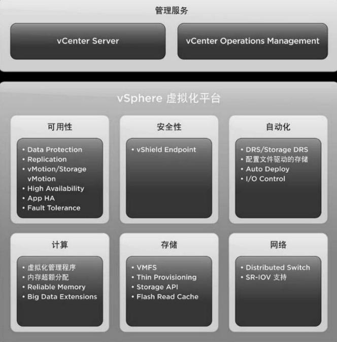
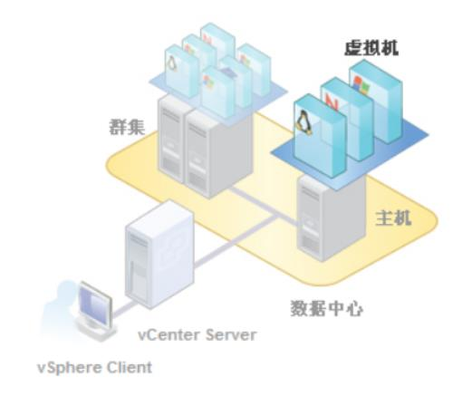

# vSphere 体系核心概念

## VMware SDDC

VMware 软件定义数据中心（software defined dataCenter，SDDC）,包括了从最底层的VMware vSphere、软件定义存储、软件定义网络、云计算平台等多个组件。VMware vSphere是业界领先的虚拟化平台，能够通过虚拟化纵向扩展和横向扩展应用、重新定义可用性和简化虚拟数据中心，最终可实现高可用、恢复能力强的的按需基础架构，这是任何云计算环境的理想基础。同时可以降低数据中心成本，增加系统和应用的正常运行时间，以及显著简化IT运行数据中心的方式。

如下图所示，展示了完整的VMware vSphere虚拟化平台

## VMware vSphere概念

VMware vSphere是VMware公司开发的虚拟化平台，是VMware软件定义数据中心的基础。

- VMware vSphere 使用虚拟化将单个数据中心转换为包括 CPU、存储和网络资源的聚合计算基础架构。VMware vSphere 将这些基础架构作为一个统一的运行环境来管理，并提供工具来管理该环境中的数据中心。

- VMware vSphere 堆栈包括虚拟化、管理和接口层。vSphere 的两个核心组件是 ESXi 和 vCenter Server。ESXi 虚拟化平台用于创建和运行虚拟机和虚拟设备。vCenter Server 是管理平台，用于管理网络和池主机资源中连接的多个主机，即将多个ESXi主机加入池中并管理这些资源。

## vSphere, vSphere client, vCenter server, ESXi 区别与联系

- vSphere

vSphere是WMware公司的一个提供虚拟化平台的软件，vSphere是在数据中心产品下的一套软件的集合，类似的软件有微软的Hyper-V、linux KVM、开源平台OpenStack等，而ESXI，vCenter是这个软件的几个重要组件，ESXi 将物理基础设施的IT资源进行虚拟化成虚拟的IT资源，而vCenter Server通过创建数据中心和集群把这些虚拟化资源进行集中的管理，并形成相应的资源池，如存储资源池，内存资源池等，而基于VCenter Server可以实现很多高级应用，如AH DRS Vmotion等，而 vSphere client则是管理ESXI主机，它有两种管理形式，一是直接管理ESXI主机，但这种形式只能管理单独的ESXI主机。第二种就是通过Vcenter Server对所有ESXI主机进行集中管理。

- ESXi

ESXi是 vSphere 中最重要的一个组件。ESXi 是安装在物理机上面的服务，ESXi 是虚拟化服务。所有的虚拟机都是运行在 ESXi 服务上面。为了安装，管理和访问这些虚拟机，你需要另外的 vSphere 套件，也就是 vSphere client 或 vCenter

- vCenter server

vCenter server 和 vSphere client 类似，但是功能更加强大。vCenter Server 安装在了 ESXi 服务器的虚拟机里面， 也可以安装在单独的物理服务器上面，如Window 服务器或 Linux 服务器（推荐安装在虚拟机）。VMware vCenter server 是一个中心化的管理应用。你可以通过它管理所有的虚拟机和 ESXi 物理机。vSphere client 可以通过访问 vCenter Server 来管理 EXSi 服务器。vCenter server 是一个企业级的产品，有许多企业级的功能，像 vMotion, VMware High Availability, VMware Update Manager 和 VMware Distributed Resource Scheduler(DRS)。你可以方便的通过 vCenter server 克隆存在的虚拟机，可以从单一控制的点管理所有vSphere的ESXi主机和虚拟机，并且可以提供详细的虚拟架构信息，进行大规模管理，极大地提高了管理员对虚拟环境的控制能力。所以，vCenter 也是 vSphere 套件的一个重要组成部分，是整个vSphere平台的中心。需要单独购买 vCenter 的 license。

- vSphere client

vSphere Client 安装在客户机（也就是管理员的笔记本或PC 机）上，允许管理员访问 ESXi 服务并管理虚拟机。vSphere client 被用来连接 ESXi 服务器和管理任务。即vSphere Client 和 vCenter Server 都可以管理 ESXi 服务器，前者是一个客户端，后者是集中管理服务。 vCenter 服务通常用在有很多 EXSi 服务和许多虚拟机的大规模环境中。vCenter 也可以使用 vSphere client 来管理。所以 vSphere client 可以在小环境中直接管理 ESXi 服务，也可以在大规模的环境中集中管理，通过 vCenter 服务间接管理 ESXi 服务。

如下图所示，展示了vSphere组建之间的关系：

