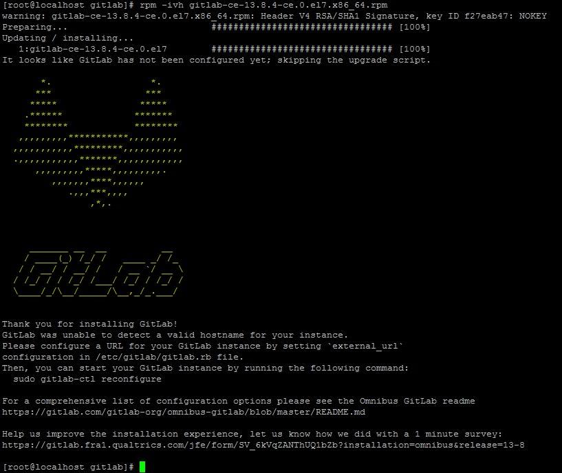

# GitLab 笔记

### 在脚本中通过Personal Access Token 访问 GitLab 的 API

1. **生成Token:**

    - 点击右上用户头像
    
    - 在弹出的菜单中点击设置
    
    - 点击左侧的Access Token
    
    - 设置Name, 有效期, 范围
    
    - 点击Create personal access token, 会在上面生成一个token, 复制保存, 这个Token只是第一次创建的时候能看到, 以后都不能看到

2. **使用Token:**

```Python
# -*- coding: utf-8 -*-
import requests
import json
import urllib
import sys
import re


black_str = " "
main_http = "http://<gitlabip>"
main_url = main_http + "/api/v4/"
headers = {
    'PRIVATE-TOKEN': "sMmud73LjS243TmjQcZH", #root
    }


def get_project_list():

    url = main_url + "groups/project/projects?per_page=100"
    response = requests.request("GET", url, headers=headers)

    print(response.text)

    project_list = json.loads(response.text)

    print(len(project_list))
    return project_list


def get_branch_list(project_id):

    url = main_url + "projects/" + str(project_id) + "/repository/branches?per_page=100"
    response = requests.request("GET", url, headers=headers)

    print(response.text)

    branch_list = json.loads(response.text)

    print(len(branch_list))
    return branch_list


def is_exist_file(project_id, branch, file_path):

    file_path_url = urllib.quote(file_path)
    file_path_url = file_path_url.replace('/',  '%2F')
    url = main_url + "projects/" + str(project_id) + "/repository/files/" + file_path_url
    querystring = {"ref": branch}

    response = requests.request("GET", url, headers=headers, params=querystring)

    return response.ok


def delete_file(project_id, branch, file_path):

    file_path_url = urllib.quote(file_path)
    file_path_url = file_path_url.replace('/',  '%2F')
    url = main_url + "projects/" + str(project_id) + "/repository/files/" + file_path_url
    querystring = {"branch": branch, "commit_message": "delete " + file_path}

    response = requests.request("DELETE", url, headers=headers, params=querystring)

    return response.ok


def get_project_hooks(project_id):

    url = main_url + "projects/" + str(project_id) + "/hooks"
    response = requests.request("GET", url, headers=headers)

    print(response.text)

    hook_list = json.loads(response.text)

    print(len(hook_list))
    return hook_list


def get_project_name(url):

    return re.findall(r"project/(.+?).git", url)[0]


def get_namespace_info(name):

    url = main_url + "namespaces"
    querystring = {"search": name}

    response = requests.request("GET", url, headers=headers, params=querystring)

    print(response.text)

    namespaces_info = json.loads(response.text)[0]

    return namespaces_info


def create_project_info(namespace_id, name):

    url = main_url + "projects"
    querystring = {"name": name, "namespace_id": namespace_id}

    response = requests.request("POST", url, headers=headers, params=querystring)

    print(response.text)

    project_info = json.loads(response.text)

    return project_info


def get_project_file(group, project, branch, file_path):

    url = '/'.join([main_http, group, project, 'raw', branch, file_path])

    response = requests.request("GET", url, headers=headers)

    return response.text


def main():

    return


if __name__ == '__main__':
    try:
        main()
    except:
        sys.exit(-1)
```

### GitLab服务器搭建

系统为CentOS7

1. 下在gitlab的rpm包: 在https://mirrors.tuna.tsinghua.edu.cn/gitlab-ce/yum/el7/网址找最新的版本

    ```Shell
    wget https://mirrors.tuna.tsinghua.edu.cn/gitlab-ce/yum/el7/gitlab-ce-13.9.1-ce.0.el7.x86_64.rpm
    ```

2. 安装: rpm -ivh gitlab-ce-13.9.1-ce.0.el7.x86_64.rpm

    


