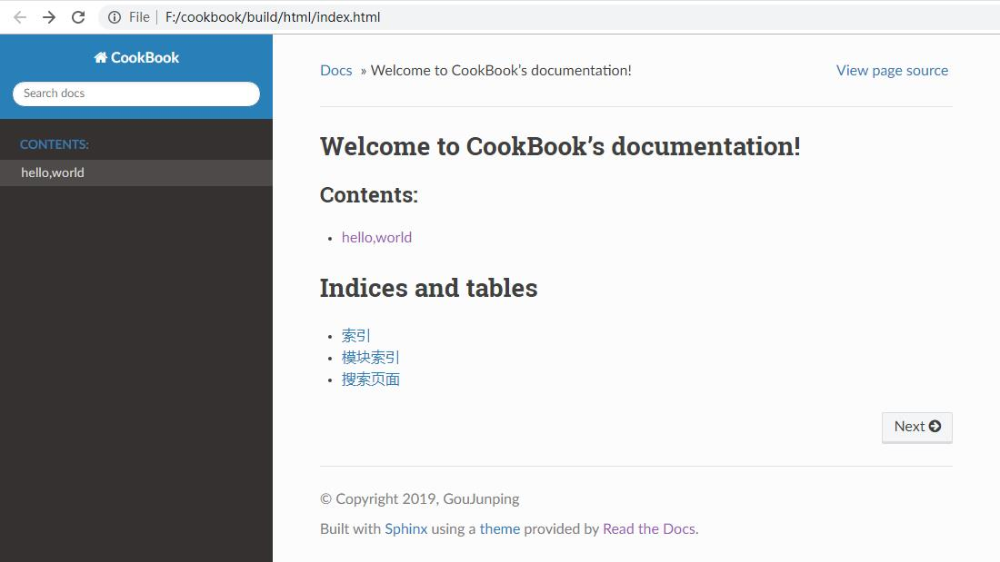
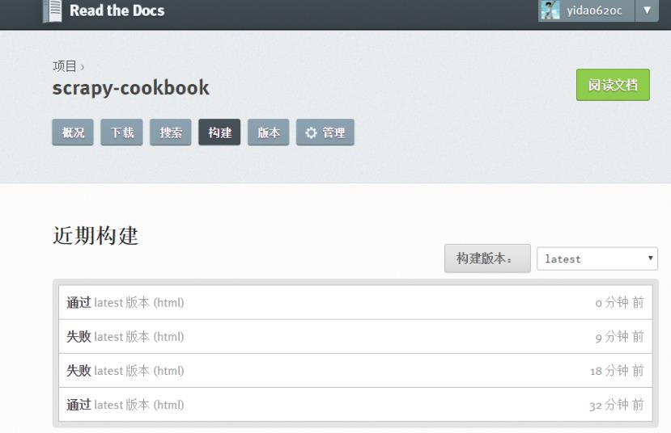
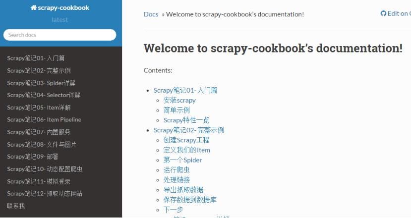

搭建ReadtheDocs托管笔记
===============================

Read the Docs是一个在线文档托管服务, 你可以从各种版本控制系统中导入文档, 如果你使用webhooks, 
那么每次提交代码后可以自动构建并上传至readthedocs网站, 非常方便.

一般来讲, 这个非常适合写软件文档以及编写一些教程, 电子书之类. 对于一些一两篇文章就能写清楚的
可以记笔记或写博客, 但是如果要写成一个系列的, 不如写成一本书的形式, 更美观, 也更系统.

Sphinx + GitHub + ReadtheDocs 作为文档写作工具, 用 Sphinx 生成文档, GitHub 托管文档, 再导入
到 ReadtheDocs.

Sphinx
---------

Sphinx是一个基于Python的文档生成项目, 最早只是用来生成 Python 官方文档, 随着工具的完善, 越来
越多的知名的项目也用他来生成文档, 甚至完全可以用他来写书采用了reStructuredText作为文档写作语
言, 不过也可以通过模块支持其他格式, 包括MarkDown格式.

* 安装Sphinx:

.. code::

    pip install sphinx sphinx-autobuild sphinx_rtd_theme
    
* 初始化:

.. code::

    # 创建文档根目录F:\cookbook, 并在命令行中进到该目录
    cd /d F:\cookbook
    # 然后执行以下命令初始化, 可以都选默认配置
    sphinx-quickstart
    
    #以下是执行结果
    F:\cookbook>sphinx-quickstart
    Welcome to the Sphinx 2.0.1 quickstart utility.

    Please enter values for the following settings (just press Enter to
    accept a default value, if one is given in brackets).

    Selected root path: .

    You have two options for placing the build directory for Sphinx output.
    Either, you use a directory "_build" within the root path, or you separate
    "source" and "build" directories within the root path.
    > Separate source and build directories (y/n) [n]: y

    The project name will occur in several places in the built documentation.
    > Project name: CookBook
    > Author name(s): GouJunping
    > Project release []: 0.1

    If the documents are to be written in a language other than English,
    you can select a language here by its language code. Sphinx will then
    translate text that it generates into that language.

    For a list of supported codes, see
    http://sphinx-doc.org/config.html#confval-language.
    > Project language [en]: zh_CN

    Creating file .\source\conf.py.
    Creating file .\source\index.rst.
    Creating file .\Makefile.
    Creating file .\make.bat.

    Finished: An initial directory structure has been created.

    You should now populate your master file .\source\index.rst and create other documentation
    source files. Use the Makefile to build the docs, like so:
       make builder
    where "builder" is one of the supported builders, e.g. html, latex or linkcheck.

* 然后运行 tree -C . 查看生成的sphinx结构:

.. code::

    .                      
    |-- Makefile           
    |-- build              
    |-- make.bat           
    `-- source             
        |-- _static        
        |-- _templates     
        |-- conf.py        
        `-- index.rst      
                           
    4 directories, 4 files 

* 添加一篇文章, 在source目录下新建hello.rst, 内容如下:

.. code::

    hello,world
    =============

* index.rst 修改如下:

.. code::

    .. toctree::
       :maxdepth: 2
       :caption: Contents:
       
       # 这里的hello是新增的,为hello.rst的文件名
       hello

* 更改主题 sphinx_rtd_theme:

更改source/conf.py:

.. code::

    # 用以下代码替换html_theme = 'alabaster'一行
    import sphinx_rtd_theme
    html_theme = "sphinx_rtd_theme"
    html_theme_path = [sphinx_rtd_theme.get_html_theme_path()]

* 在根目录F:\cookbook执行make html命令, 输出信息如下:

.. code::

    F:\cookbook>make html
    Running Sphinx v2.0.1
    loading translations [zh_CN]... done
    making output directory... done
    building [mo]: targets for 0 po files that are out of date
    building [html]: targets for 2 source files that are out of date
    updating environment: 2 added, 0 changed, 0 removed
    reading sources... [100%] index
    looking for now-outdated files... none found
    pickling environment... done
    checking consistency... done
    preparing documents... done
    writing output... [100%] index
    generating indices... genindex
    writing additional pages... searchc:\python36\lib\site-packages\sphinx_rtd_theme\search.html:20: RemovedInSphinx30Warnin
    g: To modify script_files in the theme is deprecated. Please insert a <script> tag directly in your theme instead.
      {{ super() }}

    copying static files... done
    copying extra files... done
    dumping search index in Chinese (code: zh) ... done
    dumping object inventory... done
    build succeeded.

    The HTML pages are in build\html.

* 进入build/html目录后用浏览器打开index.html

* toctree 支持多级目录,比如要想将python.rst,java.rst笔记在不同的目录,toctree这样设置:

.. code::

    Contents:

    .. toctree::

       python/python
       swift/swift
       
    # 也可以使用通配符*来匹配所有的.rst文件
    Contents:

    .. toctree::

       python/*
       swift/*
    
支持markdown编写
------------------------

* 通过recommonmark 来支持markdown

.. code::

    pip install recommonmark
    
* 然后更改conf.py

.. code::

    from recommonmark.parser import CommonMarkParser
    source_parsers = {
        '.md': CommonMarkParser,
    }
    source_suffix = ['.rst', '.md']

* 如果想使用高级功能，可以添加AutoStructify配置，在conf.py中添加

.. code::

    # At top on conf.py (with other import statements)
    import recommonmark
    from recommonmark.transform import AutoStructify

    # At the bottom of conf.py
    def setup(app):
        app.add_config_value('recommonmark_config', {
                'url_resolver': lambda url: github_doc_root + url,
                'auto_toc_tree_section': 'Contents',
                }, True)
        app.add_transform(AutoStructify)

网上有个详细配置: https://github.com/rtfd/recommonmark/blob/master/docs/conf.py

然后修改刚刚的hello.rst，改用熟悉的hello.md编写:

.. code::

    ## hello world

    ### test markdown

再次运行make html后看效果，跟前面一样。

GitHub托管
--------------

一般的做法是将文档托管到版本控制系统比如github上面，push源码后自动构建发布到
readthedoc上面， 这样既有版本控制好处，又能自动发布到readthedoc，实在是太方便了。

先在GitHub创建一个仓库名字叫scrapy-cookbook， 然后在本地.gitignore文件中添加
build/目录，初始化git，commit后，添加远程仓库。

具体几个步骤非常简单，参考官方文档：https://github.com/rtfd/readthedocs.org:

1. 在Read the Docs上面注册一个账号
2. 登陆后点击"Import".
3. 给该文档项目填写一个名字比如 “scrapy-cookbook”, 并添加你在GitHub上面的工程HTTPS链接, 选择仓库类型为Git
4. 其他项目根据自己的需要填写后点击 “Create”，创建完后会自动去激活Webhooks，不用再去GitHub设置
5. 一切搞定，从此只要你往这个仓库push代码，readthedoc上面的文档就会自动更新.

注：在创建read the docs项目时候，语言选择”Simplified Chinese”

在构建过程中出现任何问题，都可以登录readthedoc找到项目中的”构建”页查看构建历史，点击任何一条查看详细日志:

我将自己以前博客里面的关于scrapy的文章都迁移至readthedoc，现在看看效果：

生成PDF
------------

首先要安装TeX Live，CentOS 7的yum库中的TeX Live版本比较老，所以直接安装官网上的版本。

在官网页面 下载安装包install-tl-unx.tar.gz

先安装依赖包：

.. code::

    yum install perl-Digest-MD5

然后解压缩安装:

.. code::

    tar zxf install-tl-unx.tar.gz
    cd install-tl-*
    ./install-tl  # install-tl-windows on Windows
    [... messages omitted ...]
    Enter command: i
    [... when done, see below for post-install ...]

安装时间会比较长，我这里安装大概要50分钟左右，请耐心等待…

安装完后配置PATH，在/etc/profile后面添加:

.. code::

    export PATH=/usr/local/texlive/2016/bin/x86_64-linux:$PATH

注意上面的路径改成你自己正确的路径，然后执行source /etc/profile即可

如果要生成中文PDF，还需要确认安装了东亚语言包和字体包

.. code::

    yum -y install fontconfig ttmkfdir
    # /usr/share目录就可以看到fonts和fontconfig目录
    # 首先在/usr/share/fonts目录下新建一个目录chinese：
    cd /usr/share/fonts
    mkdir chinese
    # 紧接着需要修改chinese目录的权限：
    chmod -R 755 /usr/share/fonts/chinese
    # 从C:/Windows/Fonts目录复制你想要的字体到chinese文件夹
    # msyh.ttf msyhbd.ttf simhei.ttf simsun.ttc wqy-microhei.ttc YaHeiConsolas.ttf
    ttmkfdir -e /usr/share/X11/fonts/encodings/encodings.dir
    vi /etc/fonts/fonts.conf
    <!-- Font directory list -->
    <dir>/usr/share/fonts</dir>
    <dir>/usr/share/fonts/chinese</dir>

    fc-cache
    fc-list :zh

要用XeLaTeX 取代 pdflatex，我們需要修改conf.py:

.. code::

    # 注：在生成html的时候这句话要注释
    latex_engine = 'xelatex'

然后执行

.. code::

    make clean
    make latexpdf

完成之后在build/latex目录中即可找到生成的pdf文件了

1. ReadTheDocs可以自动生成中文PDF，但ReadTheDocs服务器里的TeXLive版本太老， 导致只能
使用pdflatex而不能使用xelatex编译，再加上服务器上中文字体的限制， 所以生成的PDF效果较
差，故不采用ReadTheDocs生成的PDF
2. 本地安装TeXLive 2016，用xelatex编译，可生成更好效果的PDF，目前的策略是在本地生成PDF

生成繁体PDF
-----------------

先安装opencc

.. code::

    wget https://github.com/BYVoid/OpenCC/archive/master.zip
    unzip master.zip
    yum install -y cmake gcc gcc-c++ doxygen
    cd OpenCC-master
    make && make install
    ln -s /usr/lib/libopencc.so.2 /usr/lib64/libopencc.so.2
    
写一个shell脚本来转换源码

.. code::

    #!/bin/bash
    # 将某个文件夹所有文件简体转换成繁体字

    curdir=`pwd`
    file_dir=${curdir}/$1
    for f in $(find $file_dir -type f); do
        #echo $f
        opencc -i "${f}" -o "${f}_"
        mv -f "${f}_" "${f}"
    done

简体转繁体

.. code::

    ./stot.sh scrapy-cookbook/source/

然后上面的生成PDF步骤不变。

FAQ
------

* build的时候出现错误：! Package inputenc Error: Unicode char 我 (U+6211)

解决办法，在conf.py中添加:

.. code::

    latex_elements={# The paper size ('letterpaper' or 'a4paper').
    'papersize':'a4paper',# The font size ('10pt', '11pt' or '12pt').
    'pointsize':'12pt','classoptions':',oneside','babel':'',#必須
    'inputenc':'',#必須
    'utf8extra':'',#必須
    # Additional stuff for the LaTeX preamble.
    'preamble': r"""
    \usepackage{xeCJK}
    \usepackage{indentfirst}
    \setlength{\parindent}{2em}
    \setCJKmainfont{WenQuanYi Micro Hei}
    \setCJKmonofont[Scale=0.9]{WenQuanYi Micro Hei Mono}
    \setCJKfamilyfont{song}{WenQuanYi Micro Hei}
    \setCJKfamilyfont{sf}{WenQuanYi Micro Hei}
    \XeTeXlinebreaklocale "zh"
    \XeTeXlinebreakskip = 0pt plus 1pt
    """}

* WARNING: Pygments lexer name u’python run.py’ is not known

解决办法，写代码的时候别用’’’python run.py这样的格式，不支持

* WARNING: nonlocal image URI found

解决办法，更改conf.py

.. code::

    import sphinx.environment
    from docutils.utils import get_source_line

    def _warn_node(self, msg, node, **kwargs):
        if not msg.startswith('nonlocal image URI found:'):
            self._warnfunc(msg, '%s:%s' % get_source_line(node), **kwargs)

    sphinx.environment.BuildEnvironment.warn_node = _warn_node

* 生成的PDF文件中图片不能显示的问题

解决办法，因为文章里面引用的是外部图片链接，导致不能显示图片， 将图片下载
到source/images目录，然后改链接为相对路径。

如要居中显示图片，使用

.. code::

    

* 自动生成标题问题

修改conf.py将manual改成howto

.. code::

    latex_documents = [
        (master_doc, 'scrapy-cookbook.tex', u'scrapy-cookbook Documentation',
         u'Xiong Neng', 'howto'),
    ]

* 图片覆盖文字的问题

养成一个好习惯就是新增图片一定要空一行

.. code::

    one line

    

    two line

* 生成的pdf文件中，每个章节都多了一层编号

我猜测这个问题的原因是sphinx将rst转为LaTex文件，再转为PDF的。sphinx生成的LaTex
文件中， 使用了\Section标记段落，默认情况下\Section是自动编号的章节，而\Section*才是不带自动编号的。

为了解决这个问题，需要手工编辑sphinx生成的python3-cookbook.tex

.. code::

    cd build/latex/
    vi scrapy-cookbook.tex

在\setcounter{tocdepth}{2}下增加一行\setcounter{secnumdepth}{-2}

这行代码关闭了章节编号的计数器，这样生成的PDF就是目录正确且章节不带自动编号。 请注意别乱动里面的
东西，删除一个空行也不行。

然后执行命令：

.. code::

    xelatex scrapy-cookbook.tex

这时候生成的pdf文件就是正常格式的了。如果一次执行不成功就再执行一次，很奇怪的事情。

具体原理解释参见http://liam0205.me/2015/04/10/how-to-list-unnumbered-section-in-the-table-of-contents/

优化PDF显示
-------------

这个参考 https://github.com/yidao620c/python3-cookbook/issues/108

编辑tex文件，在导言区的内容如下：

.. code::

    前面省略...
    \title{《Python Cookbook》第三版}
    \date{Dec 09, 2017}
    \release{3.0.0}
    \author{熊能}
    \newcommand{\sphinxlogo}{\vbox{@@
    \renewcommand{\releasename}{Release}
    \makeindex

    % 隐藏原目录名
    \renewcommand{\contentsname}{}

    % 在 section 前插入分页
    \usepackage{titlesec}
    \newcommand{\sectionbreak}{\clearpage}

    % 章节编号只编号到 subsection
    \newcommand\normalsecnumdepth{\setcounter{secnumdepth}{2@@

    % 所有层次章节都不编号
    \newcommand\specialsecnumdepth{\setcounter{secnumdepth}{-2@@  

    % toc 到 subsection
    \newcommand\normaltocdepth{
        \setcounter{tocdepth}{2}
        \addtocontents{toc}{\setcounter{tocdepth}{2@@
    }

    % toc 到 section
    \newcommand\specialtocdepth{
        \setcounter{tocdepth}{1}
        \addtocontents{toc}{\setcounter{tocdepth}{1@@
    }

    \begin{document}

    \maketitle
    \specialsecnumdepth
    \specialtocdepth
    \renewcommand{\contentsname}{}
    \section{目录}
    \vspace{-36pt}
    \sphinxtableofcontents
    \phantomsection\label{\detokenize{index::doc@@

    \section{版权}
    \label{\detokenize{copyright::doc@@\label{\detokenize{copyright:copyright@@\label{\detokenize{copyright:python-cookbook-3rd-edition-documentation@@
    \begin{DUlineblock}{0em}
    \item[] 书名：    《Python Cookbook》3rd Edition
    \item[] 作者：     David Beazley, Brian K. Jones
    ...

在 \section{第一章：数据结构和算法} 前插入 \normaltocdepth

在 \section{附录A} 前插入 \specialtocdepth

另外执行下面命令，删除每个章节多余的Contents和下面的一行空格：

.. code::

    sed -i '/Contents:/,+1 d' python3-cookbook.tex

再次运行生成命令即可(最好执行2次)：

.. code::

    xelatex python3-cookbook.tex

摘自: https://www.xncoding.com/2017/01/22/fullstack/readthedoc.html
