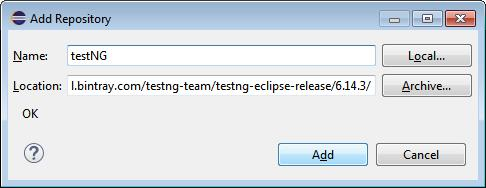
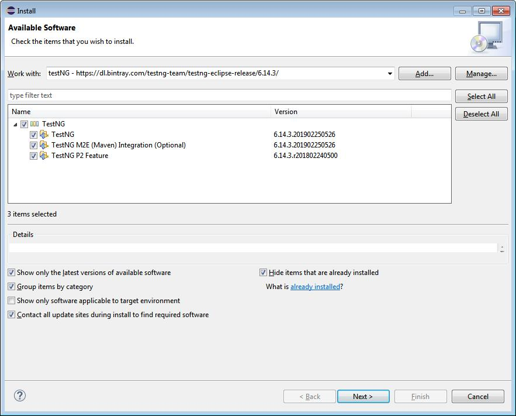

# TestNG框架

### eclipse安装

Help -> Install New Software

点击Add, 在弹出的对话框中, Name输入testNG, Location输入https://dl.bintray.com/testng-team/testng-eclipse-release/6.14.3/, 然后点击Add; 这里的版本号可以选择最新的

然后在弹出的对话框中选中TestNG, 点击下一步, 直到安装完成

