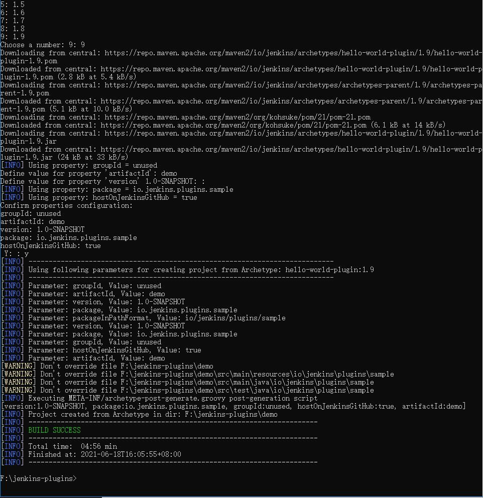

# Jenkins 插件开发

## Linux环境

### 环境安装

- 系统: 这里使用Centos7, Jenkins版本2.235.1

- JDK要求1.6以上, Maven要求3以上; 这里java版本是1.8.0, Maven版本是3.0.5; 如果没有mvn命令, 可以通过yum -y install maven来安装

```Shell
[ate@localhost ~]$ java -version
openjdk version "1.8.0_252"
OpenJDK Runtime Environment (build 1.8.0_252-b09)
OpenJDK 64-Bit Server VM (build 25.252-b09, mixed mode)
[ate@localhost ~]$
[ate@localhost ~]$ mvn -v
Apache Maven 3.0.5 (Red Hat 3.0.5-17)
Maven home: /usr/share/maven
Java version: 1.8.0_252, vendor: Oracle Corporation
Java home: /usr/lib/jvm/java-1.8.0-openjdk-1.8.0.252.b09-2.el7_8.x86_64/jre
Default locale: en_US, platform encoding: UTF-8
OS name: "linux", version: "3.10.0-957.el7.x86_64", arch: "amd64", family: "unix"
[ate@localhost ~]$
```

### 配置环境

在用户目录下创建.m2文件夹, 然后再在.m2目录下创建settings.xml文件, 全路径为(~/.m2/settings.xml)

通常是root用户: /root/.m2/settings.xml

配置内容如下

```Xml
<settings>
  <pluginGroups>
    <pluginGroup>org.jenkins-ci.tools</pluginGroup> 
  </pluginGroups>

  <profiles>
    <profile>
      <id>jenkins</id>
      <activation>
        <activeByDefault>true</activeByDefault> 
      </activation>
      <repositories> 
        <repository>
          <id>repo.jenkins-ci.org</id>
          <url>https://repo.jenkins-ci.org/public/</url>
        </repository>
      </repositories>
      <pluginRepositories>
        <pluginRepository>
          <id>repo.jenkins-ci.org</id>
          <url>https://repo.jenkins-ci.org/public/</url>
        </pluginRepository>
      </pluginRepositories>
    </profile>
  </profiles>
</settings>
```

### 创建插件项目

执行以下命令**mvn -U archetype:generate -Dfilter=io.jenkins.archetypes:**, 中间需要选择版本, groupId等属性

```Shell
[root@localhost jenkins_plug]# mvn -U archetype:generate -Dfilter=io.jenkins.archetypes:
[INFO] Scanning for projects...
Downloading: https://repo.maven.apache.org/maven2/org/apache/maven/plugins/maven-clean-plugin/2.4.1/maven-clean-plugin-2.4.1.pom
Downloaded: https://repo.maven.apache.org/maven2/org/apache/maven/plugins/maven-clean-plugin/2.4.1/maven-clean-plugin-2.4.1.pom (5 KB at 1.6 KB/sec)
Downloading: https://repo.maven.apache.org/maven2/org/apache/maven/plugins/maven-plugins/18/maven-plugins-18.pom
Downloaded: https://repo.maven.apache.org/maven2/org/apache/maven/plugins/maven-plugins/18/maven-plugins-18.pom (13 KB at 26.7 KB/sec)
Downloading: https://repo.maven.apache.org/maven2/org/apache/maven/maven-parent/16/maven-parent-16.pom
Downloaded: https://repo.maven.apache.org/maven2/org/apache/maven/maven-parent/16/maven-parent-16.pom (23 KB at 49.2 KB/sec)
Downloading: https://repo.maven.apache.org/maven2/org/apache/apache/7/apache-7.pom
Downloaded: https://repo.maven.apache.org/maven2/org/apache/apache/7/apache-7.pom (15 KB at 33.5 KB/sec)
Downloading: https://repo.maven.apache.org/maven2/org/apache/maven/plugins/maven-clean-plugin/2.4.1/maven-clean-plugin-2.4.1.jar
Downloaded: https://repo.maven.apache.org/maven2/org/apache/maven/plugins/maven-clean-plugin/2.4.1/maven-clean-plugin-2.4.1.jar (23 KB at 53.1 KB/sec)
Downloading: https://repo.maven.apache.org/maven2/org/apache/maven/plugins/maven-install-plugin/2.3.1/maven-install-plugin-2.3.1.pom
Downloaded: https://repo.maven.apache.org/maven2/org/apache/maven/plugins/maven-install-plugin/2.3.1/maven-install-plugin-2.3.1.pom (5 KB at 4.6 KB/sec)
Downloading: https://repo.maven.apache.org/maven2/org/apache/maven/plugins/maven-install-plugin/2.3.1/maven-install-plugin-2.3.1.jar
...
Downloaded: https://repo.maven.apache.org/maven2/org/apache/ant/ant/1.8.1/ant-1.8.1.jar (1479 KB at 20.3 KB/sec)
Downloaded: https://repo.maven.apache.org/maven2/org/codehaus/groovy/groovy/2.4.16/groovy-2.4.16.jar (4602 KB at 10.8 KB/sec)
[INFO] Generating project in Interactive mode
[INFO] No archetype defined. Using maven-archetype-quickstart (org.apache.maven.archetypes:maven-archetype-quickstart:1.0)
Choose archetype:
1: remote -> io.jenkins.archetypes:empty-plugin (Skeleton of a Jenkins plugin with a POM and an empty source tree.)
2: remote -> io.jenkins.archetypes:global-configuration-plugin (Skeleton of a Jenkins plugin with a POM and an example piece of global configuration.)
3: remote -> io.jenkins.archetypes:global-shared-library (Uses the Jenkins Pipeline Unit mock library to test the usage of a Global Shared Library)
4: remote -> io.jenkins.archetypes:hello-world-plugin (Skeleton of a Jenkins plugin with a POM and an example build step.)
5: remote -> io.jenkins.archetypes:scripted-pipeline (Uses the Jenkins Pipeline Unit mock library to test the logic inside a Pipeline script.)
Choose a number or apply filter (format: [groupId:]artifactId, case sensitive contains): : 4
Choose io.jenkins.archetypes:hello-world-plugin version:
1: 1.1
2: 1.2
3: 1.3
4: 1.4
5: 1.5
6: 1.6
Choose a number: 6: 6
Downloading: https://repo.maven.apache.org/maven2/io/jenkins/archetypes/hello-world-plugin/1.6/hello-world-plugin-1.6.pom
Downloaded: https://repo.maven.apache.org/maven2/io/jenkins/archetypes/hello-world-plugin/1.6/hello-world-plugin-1.6.pom (737 B at 0.4 KB/sec)
Downloading: https://repo.maven.apache.org/maven2/io/jenkins/archetypes/archetypes-parent/1.6/archetypes-parent-1.6.pom
Downloaded: https://repo.maven.apache.org/maven2/io/jenkins/archetypes/archetypes-parent/1.6/archetypes-parent-1.6.pom (5 KB at 8.6 KB/sec)
Downloading: https://repo.maven.apache.org/maven2/org/kohsuke/pom/21/pom-21.pom
Downloaded: https://repo.maven.apache.org/maven2/org/kohsuke/pom/21/pom-21.pom (6 KB at 10.8 KB/sec)
Downloading: https://repo.maven.apache.org/maven2/io/jenkins/archetypes/hello-world-plugin/1.6/hello-world-plugin-1.6.jar
Downloaded: https://repo.maven.apache.org/maven2/io/jenkins/archetypes/hello-world-plugin/1.6/hello-world-plugin-1.6.jar (17 KB at 9.7 KB/sec)
[INFO] Using property: groupId = unused
Define value for property 'artifactId': demo
Define value for property 'version' 1.0-SNAPSHOT: :
[INFO] Using property: package = io.jenkins.plugins.sample
Confirm properties configuration:
groupId: unused
artifactId: demo
version: 1.0-SNAPSHOT
package: io.jenkins.plugins.sample
 Y: : y
[INFO] ----------------------------------------------------------------------------
[INFO] Using following parameters for creating project from Archetype: hello-world-plugin:1.6
[INFO] ----------------------------------------------------------------------------
[INFO] Parameter: groupId, Value: unused
[INFO] Parameter: artifactId, Value: demo
[INFO] Parameter: version, Value: 1.0-SNAPSHOT
[INFO] Parameter: package, Value: io.jenkins.plugins.sample
[INFO] Parameter: packageInPathFormat, Value: io/jenkins/plugins/sample
[INFO] Parameter: version, Value: 1.0-SNAPSHOT
[INFO] Parameter: package, Value: io.jenkins.plugins.sample
[INFO] Parameter: groupId, Value: unused
[INFO] Parameter: artifactId, Value: demo
[INFO] Project created from Archetype in dir: /home/ate/jenkins_plug/demo
[INFO] ------------------------------------------------------------------------
[INFO] BUILD SUCCESS
[INFO] ------------------------------------------------------------------------
[INFO] Total time: 12:49:37.197s
[INFO] Finished at: Tue Jul 07 08:27:41 CST 2020
[INFO] Final Memory: 12M/142M
[INFO] ------------------------------------------------------------------------
[root@localhost jenkins_plug]#
```

执行完成后会在当前目录下生成一个demo目录

```Shell
demo/
├── pom.xml
└── src
    ├── main
    │   ├── java
    │   │   └── io
    │   │       └── jenkins
    │   │           └── plugins
    │   │               └── sample
    │   │                   └── HelloWorldBuilder.java
    │   └── resources
    │       ├── index.jelly
    │       └── io
    │           └── jenkins
    │               └── plugins
    │                   └── sample
    │                       ├── HelloWorldBuilder
    │                       │   ├── config_de.properties
    │                       │   ├── config_es.properties
    │                       │   ├── config_fr.properties
    │                       │   ├── config_it.properties
    │                       │   ├── config.jelly
    │                       │   ├── config.properties
    │                       │   ├── config_pt_BR.properties
    │                       │   ├── config_sv.properties
    │                       │   ├── config_tr.properties
    │                       │   ├── config_zh_CN.properties
    │                       │   ├── help-name_de.html
    │                       │   ├── help-name_es.html
    │                       │   ├── help-name_fr.html
    │                       │   ├── help-name.html
    │                       │   ├── help-name_it.html
    │                       │   ├── help-name_pt_BR.html
    │                       │   ├── help-name_sv.html
    │                       │   ├── help-name_tr.html
    │                       │   ├── help-name_zh_CN.html
    │                       │   ├── help-useFrench_de.html
    │                       │   ├── help-useFrench_es.html
    │                       │   ├── help-useFrench_fr.html
    │                       │   ├── help-useFrench.html
    │                       │   ├── help-useFrench_it.html
    │                       │   ├── help-useFrench_pt_BR.html
    │                       │   ├── help-useFrench_sv.html
    │                       │   ├── help-useFrench_tr.html
    │                       │   └── help-useFrench_zh_CN.html
    │                       ├── Messages_de.properties
    │                       ├── Messages_es.properties
    │                       ├── Messages_fr.properties
    │                       ├── Messages_it.properties
    │                       ├── Messages.properties
    │                       ├── Messages_pt_BR.properties
    │                       ├── Messages_sv.properties
    │                       ├── Messages_tr.properties
    │                       └── Messages_zh_CN.properties
    └── test
        └── java
            └── io
                └── jenkins
                    └── plugins
                        └── sample
                            └── HelloWorldBuilderTest.java

19 directories, 41 files
[root@localhost jenkins_plug]#
```


参考文档:
https://www.baeldung.com/jenkins-custom-plugin
https://www.jenkins.io/zh/doc/developer/tutorial/create/

## Windows环境

### 环境安装

1. 安装JDK

    - 在Oracle官网下载jdk然后安装
    - 新建环境变量JAVA_HOME, 值为jdk跟目录, 比如: C:\Program Files\Java\jdk1.8.0_291
    - 新建环境变量CLASSPATH, 值为".;%JAVA_HOME%\lib\dt.jar;%JAVA_HOME%\lib\tools.jar;", 第一个点号为当前目录
    - 在PATH环境变量中增加"%JAVA_HOME%\bin;%JAVA_HOME%\jre\bin;"两个路径
    
2. 安装Maven

    - 将安装包解压到任意地址, 比如"D:\Program Files\apache-maven-3.8.1"
    - 新建环境变量MAVEN_HOME, 值为上一步的路径"D:\Program Files\apache-maven-3.8.1"
    - 在PATH环境变量中增加";%MAVEN_HOME%\bin"路径
    
3. eclipse安装m2eclipse插件(我安装好eclipse后, 该插件已有, 所以执行以下步骤时会安装失败)

    - Help -> Install New Software...
    - 在弹出的界面中点击Add
    - 在弹出的界面中, Name输入m2e, Location为https://download.eclipse.org/technology/m2e/releases/1.9/1.9.1.20180912-1601, 可以https://download.eclipse.org/technology/m2e/releases网址找对应的版本
    - 勾选Maven Integration for Eclipse, 并点击下一步直到安装完毕
    - Help -> About Eclipse IDE -> Installation Details, 查看是否有m2e

4. 搭建Jenkins, 配置JENKINS_HOME环境变量, 并启动Jenkins

5. 设置maven开发环境

    - 在%USERPROFILE%目录(即用户目录, 我这里是C:\Users\Administrator)中, 创建一个.m2的目录, 并在目录中新建文件settings.xml, settings.xml文件内容如下; 其中本地仓库地址localRepository需要修改为实际地址
        ```Xml
        <?xml version="1.0" encoding="UTF-8"?>
         
        <settings>
            <!-- 指定本地仓库的存放地址，可选 -->
            <localRepository>F:\jenkins-plugins\repository</localRepository>
            
            <pluginGroups>
                <pluginGroup>org.jenkins-ci.tools</pluginGroup>
            </pluginGroups>
            
            <profiles>
                <!-- Give access to Jenkins plugins -->
                <profile>
                    <id>jenkins</id>
                    <activation>
                        <activeByDefault>true</activeByDefault> <!-- change this to false, if you don't like to have it on per default -->
                    </activation>
                    
                    <repositories>
                        <repository>
                            <id>repo.jenkins-ci.org</id>
                            <url>http://repo.jenkins-ci.org/public/</url>
                        </repository>
                    </repositories>
              
                    <pluginRepositories>
                        <pluginRepository>
                            <id>repo.jenkins-ci.org</id>
                            <url>http://repo.jenkins-ci.org/public/</url>
                        </pluginRepository>
                    </pluginRepositories>
                </profile>
            </profiles>
            
            <mirrors>
                <mirror>
                    <id>repo.jenkins-ci.org</id>
                    <url>http://repo.jenkins-ci.org/public/</url>
                    <mirrorOf>m.g.o-public</mirrorOf>
                </mirror>
            </mirrors>
        
        </settings>
        ```

    - 然后在上面配置的路径F:\jenkins-plugins下打开cmd, 在cmd中执行"mvn -U archetype:generate -Dfilter=io.jenkins.archetypes:"命令等待下载, 中间需要版本, 设置属性等, 可以参考Linux下的步骤
    
        
        
    - 打开eclipse -> File -> Import -> Maven -> Existing Maven Projects, 点击下一步, 在Root Directory选择F:\jenkins-plugins目录, 点击Finished即可
    
6. Jenkins插件项目结构

    - src/main/java 存放Java源文件
    - src/main/resources jelly/groovy视图文件
    - src/main/webapp 静态资源文件, 例如图片, HTML文件(默认情况不存在, 需要手动创建)
    - pom.xml 配置文件, Maven使用此文件编译插件
    
7. Jenkins插件编写规则

    src/main/java/io/jenkins/plugins/sample下的HelloWorldBuilder.java文件和src/main/resources/io/jenkins/plugins/sample下的HelloWorldBuilder目录必须相对应, 必须名称一致


参考: https://blog.csdn.net/q13554515812/article/details/86761757

