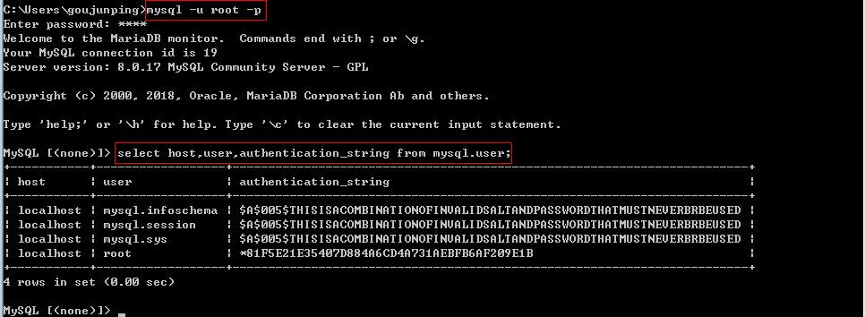
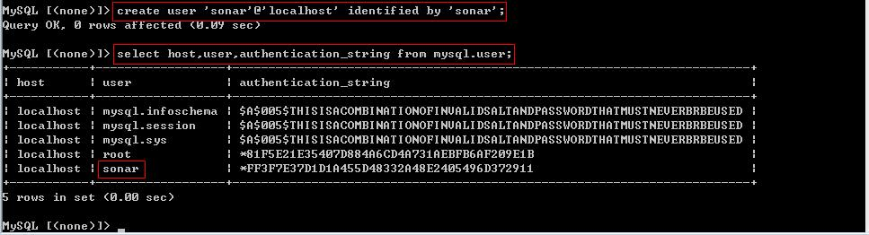
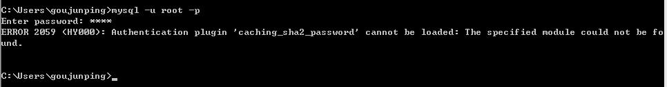
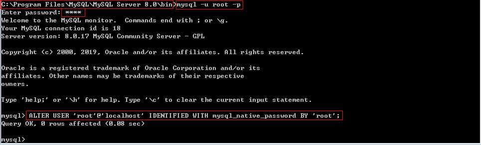

MySql新建用户
===========================

1. 登录数据库: 

.. code::

    mysql -u root -p

2. 查看现有用户：

.. code::

    select host,user,authentication_string from mysql.user;
    

3. 创建用户:

.. code::

    create user 'sonar'@'localhost' identified by 'sonar';
    

4. 删除用户:

.. code::

    drop user 'username'@'host';

5. 授权:

格式:

.. code::

    GRANT privileges on databasename.tablename to 'username'@'host' IDENTIFIED BY 'PASSWORD';

示例:

.. code::

    GRANT all privileges ON sonar.* TO 'sonar'@'%' IDENTIFIED BY 'sonar';
    
说明:

    * GRANT - 授权命令
    * priveleges - 权限列表, 可以是all priveleges, 表示所有权限, 也可以是select、update等权限, 多个权限的名词,相互之间用逗号分开
    * on - 用来指定权限针对哪些库和表
    * \*.\* 中前面的*号用来指定数据库名, 后面的*号用来指定表名
    * to - 表示将权限赋予某个用户, 如 jack@'localhost' 表示jack用户, @后面接限制的主机, 可以是IP、IP段、域名以及%, %表示任何地方。
      注意：这里%有的版本不包括本地, 以前碰到过给某个用户设置了%允许任何地方登录, 但是在本地登录不了, 这个和版本有关系, 遇到这
      个问题再加一个localhost的用户就可以了
    * identified by - 指定用户的登录密码,该项可以省略
    * WITH GRANT OPTION - 这个选项表示该用户可以将自己拥有的权限授权给别人。注意：经常有人在创建操作用户的时候不指定WITH GRANT 
      OPTION选项导致后来该用户不能使用GRANT命令创建用户或者给其它用户授权
    * 备注 - 可以使用GRANT重复给用户添加权限，权限叠加，比如你先给用户添加一个select权限，然后又给用户添加一个insert权限，那么
      该用户就同时拥有了select和insert权限

授权原则:

    * 只授予能满足需要的最小权限，防止用户干坏事。比如用户只是需要查询，那就只给select权限就可以了，不要给用户赋予update、insert
      或者delete权限
    * 创建用户的时候限制用户的登录主机，一般是限制成指定IP或者内网IP段
    * 初始化数据库的时候删除没有密码的用户。安装完数据库的时候会自动创建一些用户，这些用户默认没有密码
    * 为每个用户设置满足密码复杂度的密码
    * 定期清理不需要的用户。回收权限或者删除用户

其他示例:

    .. code::
        
    　　grant all privileges on `test`.* to 'test'@'%'; /*授予用户通过外网IP对于该数据库的全部权限*/

        grant all privileges on `test`.* to 'test'@'localhost'; /*授予用户在本地服务器对该数据库的全部权限*/

        grant select on test.* to 'user1'@'localhost'; /*给予查询权限*/

        grant insert on test.* to 'user1'@'localhost'; /*添加插入权限*/

        grant delete on test.* to 'user1'@'localhost'; /*添加删除权限*/

        grant update on test.* to 'user1'@'localhost'; /*添加权限*/

        flush privileges; /*刷新权限*/

6. 刷新权限:

.. code::

    flush privileges;
    
7. 查看权限:

.. code::

    show grants;  /*查看所有用户的权限*/
    show grants for 'sonar'@'%'; /*查看指定用户的权限*/

8. 创建数据库:

.. code::

    create database sonar;

FAQ
-----

* 安装完成后, 在命令行用命令mysql -u root -p登录数据库的时候出现以下错误:

可以进入到C:\Program Files\MySQL\MySQL Server 8.0\bin目录, 然后在当前目录下打开cmd:

然后就可以了

    

