# pytest和Allure框架

### 介绍:

pytest是一个非常成熟的全功能的python测试框架, 主要有以下几个特点:

1. 简单灵活, 容易上手; 支持参数化; 测试用例的skip和xfail处理;

2. 能够支持简单的单元测试和复杂的功能测试, 还可以用来做selenium/appium等自动化测试, 接口自动化测试(pytest+requests);

3. pytest具有很多第三方插件, 并且可以自定义扩展, 比较好用的如pytest-allure(完美html测试报告生成), pytest-xdist(多CPU分发)等;

4. 可以很好的和jenkins集成

pytest官方文档:

https://docs.pytest.org/en/latest/contents.html


### pytest及其他第三方库的安装

```Shell
pip install –U pytest
pip install sugar
pip install pytest-rerunfailures
pip install pytest-xdist
pip install pytest-assume
pip install pytest-html
pytest –h
```

### 编写规则

1. 测试文件以test_开头或者以_test.py结尾

2. 测试类以Test开头，并且不能带有init方法

3. 测试函数以test_开头

4. 断言使用基本的assert即可

### 使用及接口

1. **命令行使用及参数**

    **pytest** 运行当前目录下的所有用例
    
    **pytest test_mod.py** 运行模块test_mod.py下的所有用例
    
    **pytest somepath** 运行某个路径下的所有用例
    
    **pytest -k stringexpr** 只运行名字匹配stringexpr的类或者方法, 例如"-k 'test_method or test_other'"匹配名字中包含test_method或者test_other的类或方法; "-k 'not test_method'"匹配名字中不包含test_method的类或者方法; 这个匹配是区分大小写的
    
    **pytest test_mod.py::test_func** 只运行test_mod.py模块中的test_func方法
    
    **-v** 用于显示每个测试函数的执行结果
    
    **-q** 只显示整体测试结果
    
    **-s** 用于显示测试函数中print()函数输出
    
    **-x, --exitfirst** 第一个失败或者出错的用例后立即退出

2. setup和teardown

    - 模块级别的setup和teardown: 只调用一次, 只针对模块中的函数有用, 模块中的类方法没用
    
        ```Python
        def setup_module(module):
            """ setup any state specific to the execution of the given module."""

        def teardown_module(module):
            """teardown any state that was previously setup with a setup_module
            method.
            """
        ```
    
    - 类级别的setup和teardown: 只在类的前后调用一次
    
        ```Python
        @classmethod
        def setup_class(cls):
            """setup any state specific to the execution of the given class (which
            usually contains tests).
            """

        @classmethod
        def teardown_class(cls):
            """teardown any state that was previously setup with a call to
            setup_class.
            """
        ```

    - 方法级别的setup和teardown: 类中的每个方法都会调用一次
    
        ```Python
        def setup_method(self, method):
            """setup any state tied to the execution of the given method in a
            class.  setup_method is invoked for every test method of a class.
            """

        def teardown_method(self, method):
            """teardown any state that was previously setup with a setup_method
            call.
            """
        ```

    - 函数级别的setup和teardown: 不在类中的每个函数都会调用一次
    
        ```Python
        def setup_function(function):
            """setup any state tied to the execution of the given function.
            Invoked for every test function in the module.
            """

        def teardown_function(function):
            """teardown any state that was previously setup with a setup_function
            call.
            """
        ```

3. **pytest之fixture**

    - **fixture用途**
    
        - 做测试前后的初始化设置, 如测试数据准备, 链接数据库, 打开浏览器等这些操作都可以使用fixture来实现
        - 测试用例的前置条件可以使用fixture实现
        - 支持经典的xunit fixture, 像unittest使用的setup和teardown
        - fixture可以实现unittest不能实现的功能, 比如unittest中的测试用例和测试用例之间是无法传递参数和数据的, 但是fixture却可以解决这个问题
    
    <br/>
    
    - **firture相对于setup和teardown的优势**
    
        - 命名方式灵活，不局限于setup和teardown这几个命名
        - conftest.py 配置里可以实现数据共享, 不需要import就能自动找到一些配置
        - scope="module" 可以实现多个.py跨文件共享前置, 每一个.py文件调用一次    
        - scope="session" 以实现多个.py跨文件使用一个session来完成多个用例

    <br/>
    
    - **fixture定义**
    
        fixture通过@pytest.fixture()装饰器装饰一个函数，那么这个函数就是一个fixture
        
        ```Python
        import pytest
        import logging
        
        class TestFixture():
            @pytest.fixture()
            def fixture_function_a(self):
                logging.info('------->start fixture_function_a<-------')
                logging.info('------->end fixture_function_a<-------')
        
            def test_fixture_a(self, fixture_function_a):
                logging.info('------->start test_fixture_a<-------')
                logging.info('------->end test_fixture_a<-------')

        if __name__=='__main__':
            pytest.main(['-v', 'test_fixture.py'])
        ```
        执行该测试文件得到如下输入:
        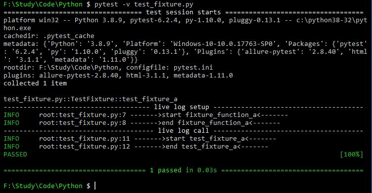
    
    <br/>  
    
    - 调用fixture的三种方式
        
        - 将fixture的名字直接作为测试用例的参数, 见test_fixture_a; 该方法的好处是可以将fixture函数的返回值传递给测试函数; 当pytest运行测试函数时, 它会查看该测试函数中的参数, 然后搜索与这些参数具有相同名称的fixture. 一旦pytest找到这些对象, 它就会运行这些fixture.
        
        <br/>
        
        - 每个函数或者类前使用@pytest.mark.usefixtures('fixture_function_a')装饰器装饰, 见test_fixture_b
            ```Python
            import pytest
            import logging
            
            class TestFixture():
                @pytest.fixture()
                def fixture_function_a(self):
                    logging.info('------->start fixture_function_a<-------')
                    logging.info('------->end fixture_function_a<-------')
            
                def test_fixture_a(self, fixture_function_a):
                    logging.info('------->start test_fixture_a<-------')
                    logging.info('------->end test_fixture_a<-------')
            
                @pytest.mark.usefixtures('fixture_function_a')
                def test_fixture_b(self):
                    logging.info('------->start test_fixture_b<-------')
                    logging.info('------->end test_fixture_b<-------')
            
            if __name__=='__main__':
                pytest.main(['-v', 'test_fixture.py'])
            ```
            执行该测试文件得到如下输入:
            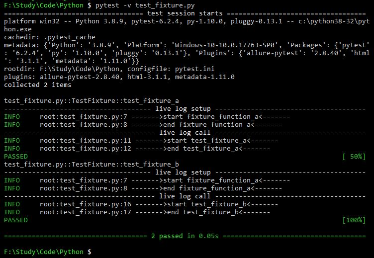
        
        <br/>
        
        - 在定义fixture的时候指定参数autouse=True, 则会根据作用域自动调用, 默认作用于为function
            ```Python
            import pytest
            import logging
            
            class TestFixture():
                @pytest.fixture(autouse=True)
                def fixture_function_a(self):
                    logging.info('------->start fixture_function_a<-------')
                    logging.info('------->end fixture_function_a<-------')
            
                def test_fixture_a(self):
                    logging.info('------->start test_fixture_a<-------')
                    logging.info('------->end test_fixture_a<-------')
            
                def test_fixture_b(self):
                    logging.info('------->start test_fixture_b<-------')
                    logging.info('------->end test_fixture_b<-------')
            
            if __name__=='__main__':
                pytest.main(['-v', 'test_fixture.py'])
            ```
            执行该测试文件得到如下输入:
            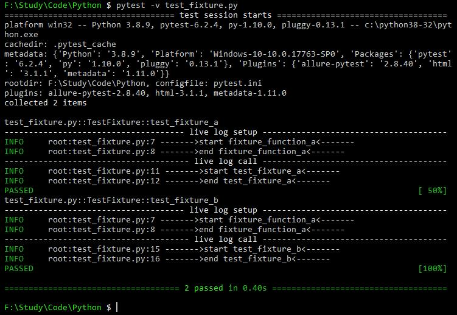
        
    <br/>
    
    - **同时使用多个fixture函数**
    
        - 通过参数方式调用多个fixture函数, fixture函数调用顺序跟传入参数的顺序相同
            ```Python
            import pytest
            import logging
            
            class TestFixture():
                @pytest.fixture()
                def fixture_function_a(self):
                    logging.info('------->start fixture_function_a<-------')
                    logging.info('------->end fixture_function_a<-------')
            
                @pytest.fixture()
                def fixture_function_b(self):
                    logging.info('------->start fixture_function_b<-------')
                    logging.info('------->end fixture_function_b<-------')
            
                def test_fixture_a(self, fixture_function_a, fixture_function_b):
                    logging.info('------->start test_fixture_a<-------')
                    logging.info('------->end test_fixture_a<-------')
            
                def test_fixture_b(self, fixture_function_b, fixture_function_a):
                    logging.info('------->start test_fixture_b<-------')
                    logging.info('------->end test_fixture_b<-------')
            
            if __name__=='__main__':
                pytest.main(['-v', 'test_fixture.py'])
            ```
            执行该测试文件得到如下输入:
            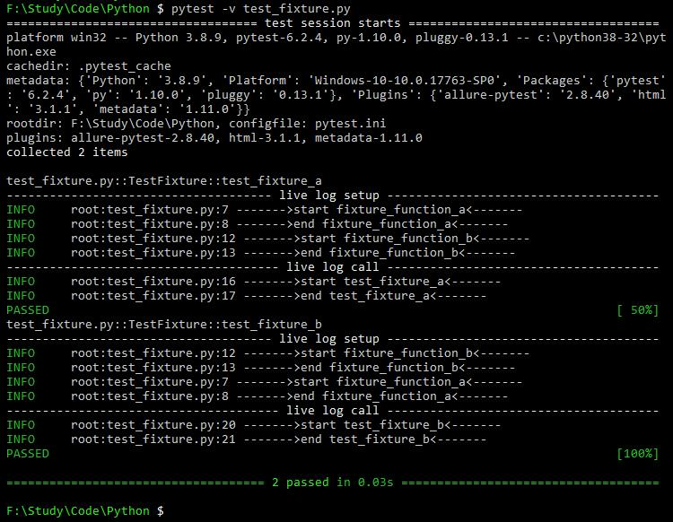
        
        <br/>
        
        - 使用装饰器的方式调用多个fixture函数, fixture函数调用顺序跟装饰器的顺序相反
            ```Python
            import pytest
            import logging
            
            class TestFixture():
                @pytest.fixture()
                def fixture_function_a(self):
                    logging.info('------->start fixture_function_a<-------')
                    logging.info('------->end fixture_function_a<-------')
            
                @pytest.fixture()
                def fixture_function_b(self):
                    logging.info('------->start fixture_function_b<-------')
                    logging.info('------->end fixture_function_b<-------')
            
                @pytest.mark.usefixtures('fixture_function_a')  # 后执行
                @pytest.mark.usefixtures('fixture_function_b')  # 先执行
                def test_fixture_a(self):
                    logging.info('------->start test_fixture_a<-------')
                    logging.info('------->end test_fixture_a<-------')
            
                @pytest.mark.usefixtures('fixture_function_b')  # 后执行
                @pytest.mark.usefixtures('fixture_function_a')  # 先执行
                def test_fixture_b(self):
                    logging.info('------->start test_fixture_b<-------')
                    logging.info('------->end test_fixture_b<-------')
            
            if __name__=='__main__':
                pytest.main(['-v', 'test_fixture.py'])
            ```
            执行该测试文件得到如下输入:
            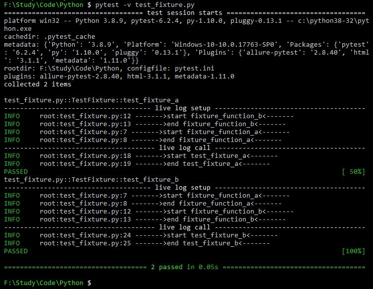
 
        <br/>
        
        - 使用autouse=True的方式调用多个fixture函数, fixture函数调用顺序是根据fixture函数名的顺序调用的
            ```Python
            import pytest
            import logging
            
            class TestFixture():
                @pytest.fixture(autouse=True)
                def fixture_function_b(self):
                    logging.info('------->start fixture_function_b<-------')
                    logging.info('------->end fixture_function_b<-------')
            
                @pytest.fixture(autouse=True)
                def fixture_function_a(self):
                    logging.info('------->start fixture_function_a<-------')
                    logging.info('------->end fixture_function_a<-------')
            
                def test_fixture_a(self):
                    logging.info('------->start test_fixture_a<-------')
                    logging.info('------->end test_fixture_a<-------')
            
                def test_fixture_b(self):
                    logging.info('------->start test_fixture_b<-------')
                    logging.info('------->end test_fixture_b<-------')
            
            if __name__=='__main__':
                pytest.main(['-v', 'test_fixture.py'])
            ```
            执行该测试文件得到如下输入:
            
        
        <br/>
        
        - 同一个用例使用三种方式调用多个fixture函数时, autouse=True方式定义的fixture函数最先调用, 然后调用装饰器调用的, 最后再调用参数传入的
        如下例, 测试用例test_fixture_a调用fixture函数的顺序为fixture_function_b, fixture_function_a, fixture_function_c; 测试用例test_fixture_b调用fixture函数的顺序为测试用例test_fixture_a调用fixture函数的顺序为fixture_function_b, fixture_function_c, fixture_function_a
            ```Python
            import pytest
            import logging
            
            class TestFixture():
                @pytest.fixture()
                def fixture_function_a(self):
                    logging.info('------->start fixture_function_a<-------')
                    logging.info('------->end fixture_function_a<-------')
            
                @pytest.fixture(autouse=True)
                def fixture_function_b(self):
                    logging.info('------->start fixture_function_b<-------')
                    logging.info('------->end fixture_function_b<-------')
            
                @pytest.fixture()
                def fixture_function_c(self):
                    logging.info('------->start fixture_function_c<-------')
                    logging.info('------->end fixture_function_c<-------')
            
                def test_fixture_a(self, fixture_function_a, fixture_function_c):
                    logging.info('------->start test_fixture_a<-------')
                    logging.info('------->end test_fixture_a<-------')
            
                @pytest.mark.usefixtures('fixture_function_c')
                def test_fixture_b(self, fixture_function_a):
                    logging.info('------->start test_fixture_b<-------')
                    logging.info('------->end test_fixture_b<-------')
            
            if __name__=='__main__':
                pytest.main(['-v', 'test_fixture.py'])
            ```

            执行该测试文件得到如下输入:
            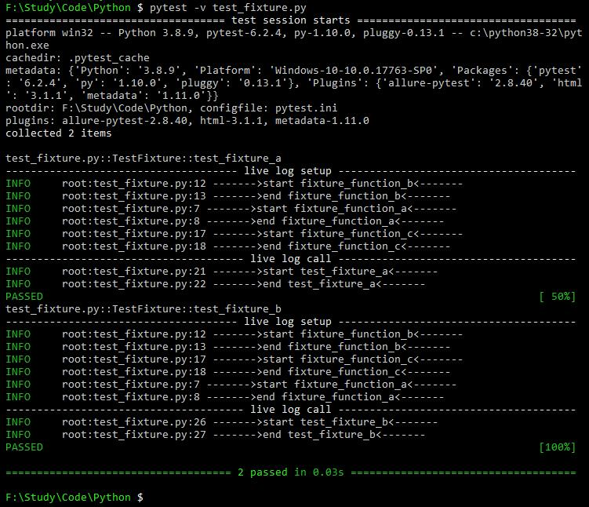

    <br/>
    
    - 使用fixture函数的返回值
            ```Python
            import pytest
            import logging
            
            class TestFixture():
                @pytest.fixture()
                def fixture_function_b(self):
                    logging.info('------->start fixture_function_b<-------')
                    logging.info('------->end fixture_function_b<-------')
                    return 'fixture_function_b result'
            
                def test_fixture_a(self, fixture_function_b):
                    logging.info('------->start test_fixture_a<-------')
                    logging.info(fixture_function_b)
                    logging.info('------->end test_fixture_a<-------')
            
            if __name__=='__main__':
                pytest.main(['-v', 'test_fixture.py'])
            ```
            执行该测试文件得到如下输入:
            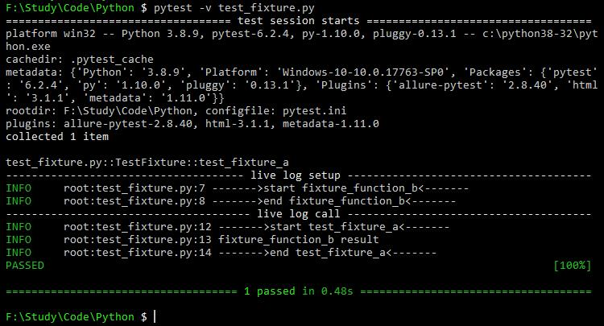
      
    <br/>
    
    - **装饰器\@pytest.fixture的作用域有四种**

        - **\@pytest.fixture(scope='function')** 每个test都运行, 默认是function的scope        
        - **\@pytest.fixture(scope='class')** 每个class的所有test只运行一次
        - **\@pytest.fixture(scope='module')** 每个module的所有test只运行一次
        - **\@pytest.fixture(scope='session')** 每个session只运行一次
    
    <br/> 
    
    - **fixture函数参数化**
    
        在@pytest.fixture装饰器中指定一个参数列表, 则会对列表中的每一个参数调用一次对应的测试用例
        ```Python
        import pytest
        import logging
        
        class TestFixture():
            @pytest.fixture(scope="module", params=[[1, 1, 2], [2, 8, 10], [99, 1, 100]])
            def fixture_function_a(self, request):
                logging.info('------->start fixture_function_a<-------')
                logging.info('------->end fixture_function_a<-------')
                return request.param
        
            def test_fixture_a(self, fixture_function_a):
                logging.info('------->start test_fixture_a<-------')
                logging.info(fixture_function_a)
                logging.info('------->end test_fixture_a<-------')
        
        if __name__=='__main__':
            pytest.main(['-v', 'test_fixture.py'])
        ```
        执行该测试文件得到如下输入:
        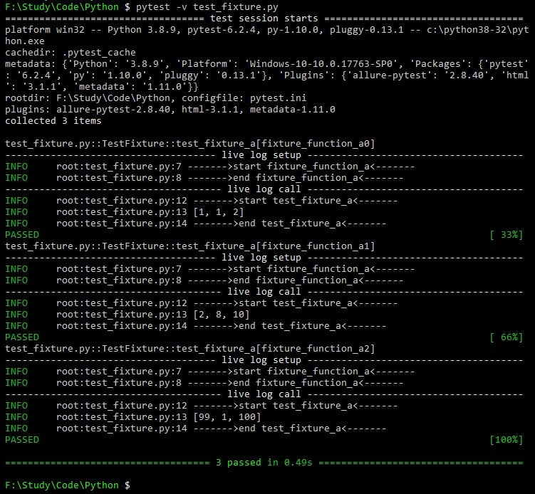
    
    <br/>
    
    - **fixture本身还可以使用其他的fixture**
        ```Python
        import pytest
        import logging
        
        class Fruit:
            def __init__(self, name):
                self.name = name
        
            def __eq__(self, other):
                return self.name == other.name
        
        @pytest.fixture
        def my_fruit():
            # 这里是一个fixture, 返回了一个Fruit对象, name为apple
            logging.info('------->start my_fruit<-------')
            logging.info('------->end my_fruit<-------')
            return Fruit('apple')

        @pytest.fixture
        def fruit_basket(my_fruit):
            # 这里是另一个fixture, 同样声明一个Fruit对象, name为banana
            # 然后在这个fixture中又传入了上一个fixture：my_fruit
            # 最后把最终的返回装到一个列表[]里，返回
            logging.info('------->start fruit_basket<-------')
            logging.info('------->end fruit_basket<-------')
            return [Fruit('banana'), my_fruit]

        def test_my_fruit_in_basket(my_fruit, fruit_basket):
            # 这是一个测试函数，可以使用多个fixture
            logging.info('------->start test_my_fruit_in_basket<-------')
            logging.info(my_fruit)
            logging.info(fruit_basket)
            logging.info('------->end test_my_fruit_in_basket<-------')
            assert my_fruit in fruit_basket
        
        if __name__=='__main__':
            pytest.main(['-v', 'test_fixture.py'])
        ```
        执行该测试文件得到如下输入:
        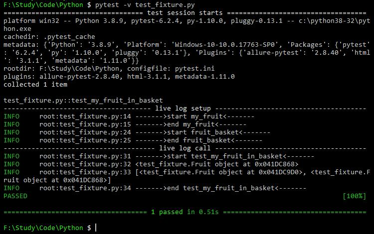
        
        在同一个测试函数中, fixture也可以被请求多次. 但是在这个测试函数中, pytest在第一次执行fixture函数之后, 不会再次执行它们.
        如果第一次执行fixture函数有返回值, 那么返回值会被缓存起来.
        ```Python
        import pytest
        import logging
        
        # Arrange
        @pytest.fixture
        def first_entry():
            logging.info('------->start first_entry<-------')
            logging.info('------->end first_entry<-------')
            return "a"
        
        # Arrange
        @pytest.fixture
        def order():
            logging.info('------->start order<-------')
            logging.info('------->end order<-------')
            return []
        
        # Act
        @pytest.fixture
        def append_first(order, first_entry):
            # 在这里order第一次被请求, 返回一个列表[]
            # 接着, order空列表增加了first_entry的返回值, 此时的order变成了["a"], 被缓存起来
            logging.info('------->start append_first<-------')
            logging.info(order)
            logging.info(first_entry)
            logging.info('------->end append_first<-------')
            return order.append(first_entry)
        
        def test_string_only(append_first, order, first_entry):
            # 在测试函数里, order第二次被请求, 但是并不会拿到空列表[], 而且拿到了被缓存起来的["a"]
            # 所以断言order == [first_entry], 其实就是 ["a"] == ["a"], 测试通过
            # Assert
            logging.info('------->start test_string_only<-------')
            logging.info(order)
            logging.info(first_entry)
            logging.info('------->end test_string_only<-------')
            assert order == [first_entry]
        
        if __name__=='__main__':
            pytest.main(['-v', 'test_fixture.py'])
        ```
        执行该测试文件得到如下输入:
        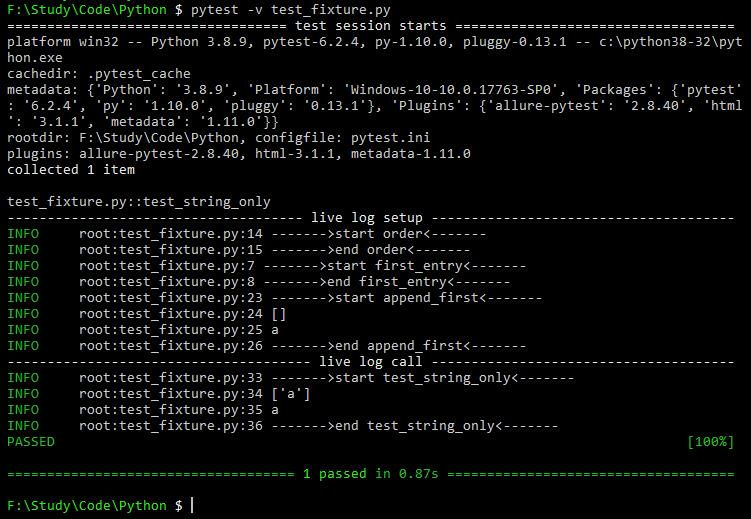
        
    <br/>
    
    - **Fixture errors, 当fixtures抛错后**
    
        在pytest中, 如果一个测试函数中传入了多个fixture函数, 那么pytest会尽可能的按线性顺序先后执行. 如果, 先执行的fixture函数有问题引发了异常, 那么pytest将会停止执行这个测试函数的fixture, 并且标记此测试函数有错误.
        但是, 当测试被标记为有错误时, 并不是说这个测试函数的结果失败了, 这仅仅意味着测试函数所依赖的fixture有问题, 导致测试函数不能正常进行.
        
        ```Python
        import pytest
        import logging
        
        class TestFixture():
            @pytest.fixture()
            def fixture_function_a(self):
                logging.info('------->start fixture_function_a<-------')
                1/0
                logging.info('------->end fixture_function_a<-------')
        
            @pytest.fixture(autouse=True)
            def fixture_function_b(self):
                logging.info('------->start fixture_function_b<-------')
                logging.info('------->end fixture_function_b<-------')
        
            @pytest.fixture()
            def fixture_function_c(self):
                logging.info('------->start fixture_function_c<-------')
                logging.info('------->end fixture_function_c<-------')
        
            def test_fixture_a(self, fixture_function_a, fixture_function_c):
                logging.info('------->start test_fixture_a<-------')
                logging.info('------->end test_fixture_a<-------')
        
            @pytest.mark.usefixtures('fixture_function_c')
            def test_fixture_b(self, fixture_function_a):
                logging.info('------->start test_fixture_b<-------')
                logging.info('------->end test_fixture_b<-------')
        
        if __name__=='__main__':
            pytest.main(['-v', 'test_fixture.py'])
        ```
        执行该测试文件得到如下输入:
        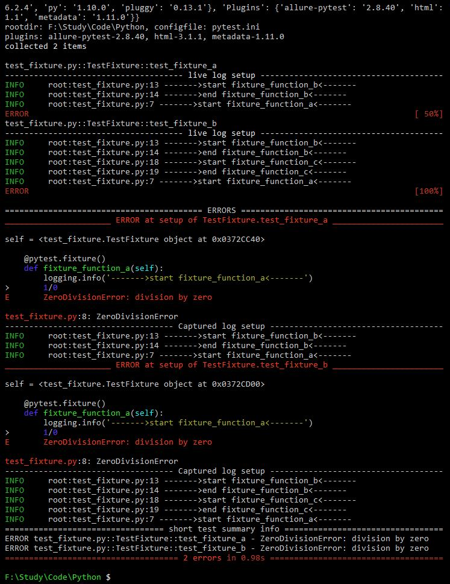
        
        这里测试用例test_fixture_a先执行fixture_function_b正常, 然后执行fixture_function_a时异常, 后面就不会继续执行fixture_function_c了; 测试用例test_fixture_b先执行fixture_function_b正常, 然后执行fixture_function_c正常, 最后执行fixture_function_a是异常

    <br/>
    
    - **Teardown处理, yield和addfinalizer**
    
        当我们运行测试函数时, 我们希望确保测试函数在运行结束后, 可以自己清理掉对环境的影响. 这样的话, 它们就不会干扰任何其他的测试函数, 更不会日积月累的留下越来越多的测试数据. 在pytest中的fixture, 可以使用yield和addfinalizer两种方式来实现Teardown的功能
        
        在有yield的fixtures函数中, 关键字yield可以代替return, 可以把fixture里的一些对象传递给调用它们的fixture函数或者测试函数. 就像其他普通的fixture函数一样. 区别仅仅是：
        
        - yield替换掉了return
        - teardown代码放置在yield之后
        
        yield的执行顺序: pytest在执行fixture函数时, 会根据fixture函数之间的线性关系顺序调用的. 但是, 当测试函数运行结束的时候, pytest又会按照之前的顺序反方向来执行fixture中yield之后的代码.
        
        ```Python
        import pytest
        import logging
        
        @pytest.fixture
        def fixture_one():
            logging.info("执行fixture_one")
            return 1
        
        
        @pytest.fixture
        def fixture_two(fixture_one):
            logging.info("执行fixture_two")
            yield 2
            logging.info("执行fixture_two的teardown代码")
        
        
        @pytest.fixture
        def fixture_adding(fixture_one, fixture_two):
            logging.info("执行fixture_adding")
            result = fixture_one + fixture_two
            yield result
            logging.info("执行fixture_adding的teardown代码")
        
        
        def test_demo(fixture_two, fixture_adding):
            logging.info("执行测试函数test_demo")
            assert fixture_adding == 3
        
        if __name__=='__main__':
            pytest.main(['-v', 'test_fixture.py'])
        ```
        执行该测试文件得到如下输入:
        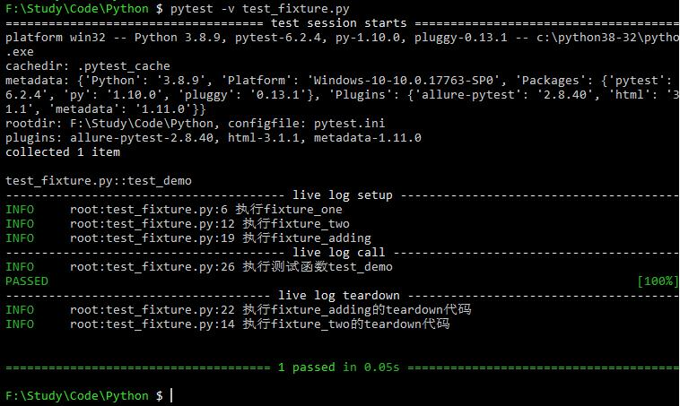
        
        request.addfinalizer把函数变成终结器:
        ```Python
        import pytest
        import logging
        
        @pytest.fixture()
        def demo_fixture(request):
            logging.info("这个fixture在每个case前执行一次")
            def demo_finalizer():
                logging.info("在每个case完成后执行的teardown")
        
            #注册demo_finalizer为终结函数    
            request.addfinalizer(demo_finalizer)
        
        def test_01(demo_fixture):
            logging.info("===执行了case: test_01===")
        
        def test_02(demo_fixture):
            logging.info("===执行了case: test_02===")
        
        if __name__=='__main__':
            pytest.main(['-v', 'test_fixture.py'])
        ```
        执行该测试文件得到如下输入:
        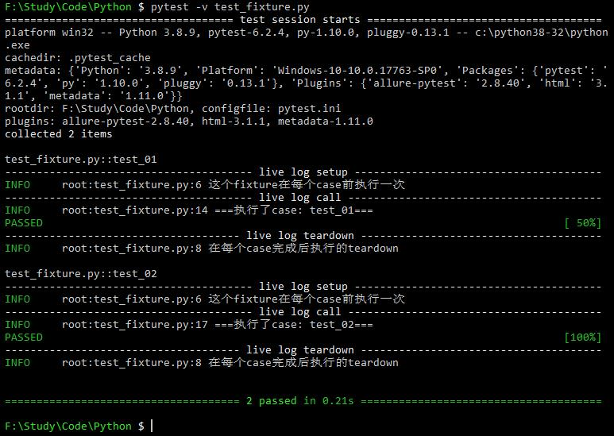
        
        可以看出demo_finalizer函数会在每个用例结束后执行
        
        request.addfinalizer注册多个终结器函数:
        
        ```Python
        import pytest
        import logging
        
        @pytest.fixture()
        def demo_fixture(request):
            logging.info("这个fixture在每个case前执行一次")
            def demo_finalizer():
                logging.info("在每个case完成后执行的teardown")
            def demo_finalizer2():
                logging.info("在每个case完成后执行的teardown2")
        
            #注册demo_finalizer为终结函数
            request.addfinalizer(demo_finalizer)
            request.addfinalizer(demo_finalizer2)
        
        def test_01(demo_fixture):
            logging.info("===执行了case: test_01===")
        
        def test_02(demo_fixture):
            logging.info("===执行了case: test_02===")
        
        if __name__=='__main__':
            pytest.main(['-v', 'test_fixture.py'])
        ```
        执行该测试文件得到如下输入:
        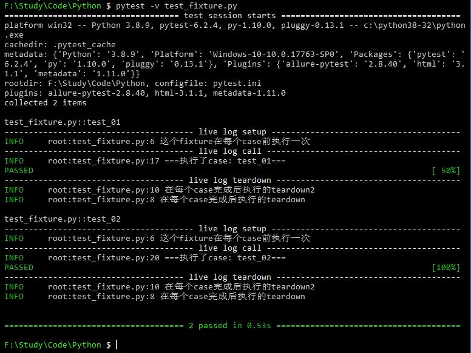
        
        从上例可以看出: 多个终结器的情况下, 执行的顺序是与注册时候相反的
        
        **<font color=red>注意: 只要终结函数注册成功, 终结函数总是会执行到; 在setup的时候, 如果在注册终结函数之前失败了, 则不会执行终结函数, 因为还没有执行注册的步骤; 所以终结函数最好放在setup的前面</font>**
      
    <br/>
    
    - **如何让fixture函数更可靠**
    
        fixture功能强大, 用来处理setup, teardown非常的灵活, 好用. 但是, 毕竟它也只是一段程序代码, 虽然可以帮我们做setup, teardown的处理, 但是并不代表任何情况下都可以完美处理掉. 拿teardown来说, 假如我们写的代码不小心报错了, 导致该删掉的没删掉, 那么就可能会导致后续一些奇怪的问题发生.
        其实很多事情要想可靠, 首先必须要简单. 让每个fixture函数里只做一种状态的操作. 
        
        <br/>
        
        - <font color=red>不可靠fixture函数举例:</font>
            ```Python
            import pytest
            
            from emaillib import Email, MailAdminClient
            
            @pytest.fixture
            def setup():
                mail_admin = MailAdminClient()
                sending_user = mail_admin.create_user()
                receiving_user = mail_admin.create_user()
                email = Email(subject="Hey!", body="How's it going?")
                sending_user.send_emai(email, receiving_user)
                yield receiving_user, email
                receiving_user.delete_email(email)
                admin_client.delete_user(sending_user)
                admin_client.delete_user(receiving_user)
            
            def test_email_received(setup):
                receiving_user, email = setup
                assert email in receiving_user.inbox
            ```
        
        <br/>
        
        - <font color=red>可靠fixture函数举例1:</font>
            ```Python
            import pytest
            
            from emaillib import Email, MailAdminClient
            
            @pytest.fixture
            def mail_admin():
                return MailAdminClient()
            
            @pytest.fixture
            def sending_user(mail_admin):
                user = mail_admin.create_user()
                yield user
                admin_client.delete_user(user)
            
            @pytest.fixture
            def receiving_user(mail_admin):
                user = mail_admin.create_user()
                yield user
                admin_client.delete_user(user)
            
            def test_email_received(receiving_user, email):
                email = Email(subject="Hey!", body="How's it going?")
                sending_user.send_email(_email, receiving_user)
                assert email in receiving_user.inbox
            ```
        
        <br/>
        
        - <font color=red>可靠fixture函数举例2:</font>
            ```Python
            from uuid import uuid4
            from urllib.parse import urljoin
            
            from selenium.webdriver import Chrome
            import pytest
            
            from src.utils.pages import LoginPage, LandingPage
            from src.utils import AdminApiClient
            from src.utils.data_types import User
            
            @pytest.fixture
            def admin_client(base_url, admin_credentials):
                return AdminApiClient(base_url, **admin_credentials)
            
            @pytest.fixture
            def user(admin_client):
                _user = User(name="Susan", username=f"testuser-{uuid4()}", password="P4$$word")
                admin_client.create_user(_user)
                yield _user
                admin_client.delete_user(_user)
            
            @pytest.fixture
            def driver():
                _driver = Chrome()
                yield _driver
                _driver.quit()
            
            @pytest.fixture
            def login(driver, base_url, user):
                driver.get(urljoin(base_url, "/login"))
                page = LoginPage(driver)
                page.login(user)
            
            @pytest.fixture
            def landing_page(driver, login):
                return LandingPage(driver)
            
            def test_name_on_landing_page_after_login(landing_page, user):
                assert landing_page.header == f"Welcome, {user.name}!"
            ```
     
    参考:
    https://zhuanlan.zhihu.com/p/87775743
    https://docs.pytest.org/en/latest/how-to/fixtures.html

4. 通过pytest.mark对用例打标签

    标签需要先在pytest.ini文件中注册, 比如这里注册了两个标签smoke和demo
    
    ```ini
    [pytest]
    markers =
        smoke: marks tests as smoke (deselect with '-m "not smoke"')
        serial
        
        demo: marks tests as demo (deselect with '-m "not demo"')
        serial
    ```
    
    然后就可以在用例中使用该标签了
    
    ```Python
    # file_name: test_pytest.py
    import pytest
    
    class TestMyClass():
        @pytest.mark.smoke
        @pytest.mark.demo
        def test_a(self):
            print("------->test_a start<-------")
            print("-------->test_a end<--------")
            assert 1
    
        @pytest.mark.smoke
        def test_b(self):
            print("------->test_b start<-------")
            print("-------->test_b end<--------")
            assert 1
    
        @pytest.mark.demo
        def test_c(self):
            print("------->test_c start<-------")
            print("-------->test_c end<--------")
            assert 1
    
    
    if __name__ == '__main__':
        pytest.main(["-s","test_pytest.py"])
    ```
    
    在命令行增加参数'-m "smoke"'只跑test_a和test_b, '-m "demo"'只跑test_a和test_c, '-m "smoke and demo"'只跑test_a, '-m "smoke or demo"'跑所有用例
    
    具体命令:
    
    ```Shell
    pytest -v -m "demo or smoke" test_pytest.py --html=./report.html
    ```

5. 装饰器**\@pytest.mark.parametrize**用来实现测试用例参数化

    该装饰器有两个参数, 第一个参数为字符串, 对应与函数的参数名, 多个参数名用逗号分开; 第二个参数为list, list的每个元素都是一个元组, 元组里的每个元素顺序跟参数名的顺序一一对应; 如果参数名只有一个, 则list中也只有一个元组, 此时可以省略元组, 直接用将所有元素写入list中.
    
    传一个参数\@pytest.mark.parametrize('参数名', \[参数_data\[0\], 参数_data\[1\]\])进行参数化
    
    传两个参数\@pytest.mark.parametrize('参数名1, 参数名2', \[(参数1_data\[0\], 参数2_data\[0\]), (参数1_data\[1\], 参数2_data\[1\])])进行参数化
    
    也可以传入json格式
    
    ```Python
    # file_name: test_pytest.py
    import pytest
    
    json=({"username":"alex","password":"111111"},{"username":"rongrong","password":"222222"})
    
    class TestMyClass():
        @pytest.mark.parametrize("user,pwd",[("18200000001",111111),("18200000002",222222),("18200000003",333333)])
        def test_a(self, user, pwd):
            print("------->test_a start<-------")
            print('User: {}, Password: {}'.format(user, pwd))
            print("-------->test_a end<--------")
            assert 1
    
        @pytest.mark.parametrize("user", ["18200000001", "18200000002", "18200000003"])
        @pytest.mark.parametrize("pwd", [111111, 222222, 333333])
        def test_b(self, user, pwd):
            print("------->test_b start<-------")
            print('User: {}, Password: {}'.format(user, pwd))
            print("-------->test_b end<--------")
            assert 1
    
        @pytest.mark.parametrize("json", json)
        def test_c(self, json):
            print("------->test_c start<-------")
            print(json)
            print('username : {}, password : {}'.format(json["username"], json["password"]))
            print("-------->test_c end<--------")
            assert 1
    
    
    if __name__ == '__main__':
        pytest.main(["-s","test_pytest.py"])
    ```
    
    该例中test_a会有3个用例, test_b会有9个用例, test_c会有2个用例
    
    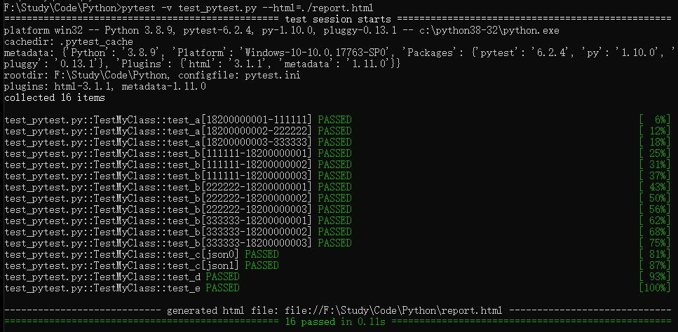
    
    参考:
    
    https://blog.51cto.com/u_15009374/2555751

6. 日志

    首先在pytest.ini中配置日志格式
    
    ```ini
    log_cli = true
    log_cli_level = DEBUG
    log_cli_date_format = %Y-%m-%d-%H-%M-%S
    log_cli_format = %(asctime)s - %(filename)s - %(module)s - %(funcName)s - %(lineno)d - %(levelname)s - %(message)s
    log_file = test.log
    log_file_level = DEBUG
    log_file_date_format = %Y-%m-%d-%H-%M-%S
    log_file_format = %(asctime)s - %(filename)s - %(module)s - %(funcName)s - %(lineno)d - %(levelname)s - %(message)s
    ```
    
    然后在需要打印日志的文件中调用
    
    ```Python
    import logging
    
    logger = logging.getLogger(__name__)
    
    logger.info("logging information")
    ```
    
    参考:
    
    https://www.cnblogs.com/poloyy/category/1690628.html?page=2

### allure测试报告框架

一. 安装

    Python库:

    ```Shell
    pip install allure-pytest
    ```

    命令工具:

    官方地址: https://github.com/allure-framework/allure2/releases

    目前最新版本是2.13.10, 但是这个版本可能有问题, 生成报告后, 用任何浏览器打开都是空白页, 在加载javascript的时候都会报错: allure is not defined; 切换到2.13.9则OK
    
    Windows需要将allure-2.13.9\bin的绝对路径加入到PATH环境变量中

    这两个工具都需要安装

二. 使用

1. 在测试脚本中 ...


2. 在执行pytest的时候指定--alluredir reports参数, 会将allure日志保存到reports目录中


3. 执行命令allure generate ./reports -c -o ./allure-reports --clean生成html报告, 这样打开index.html的时候没有数据; 需要通过服务的方式打开(命令:allure serve ./reports), 这样会自动打开默认浏览器并显示结果


三. 将allure集成到Jenkins中


