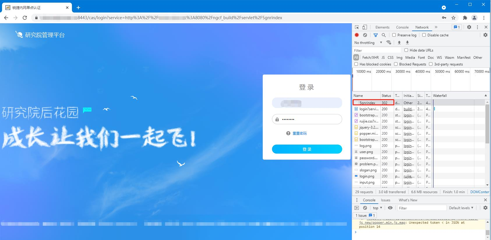
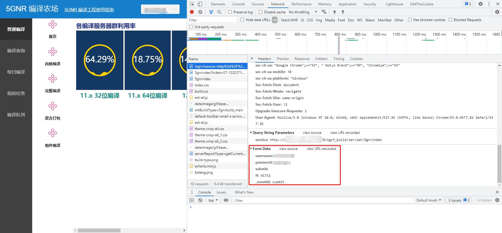
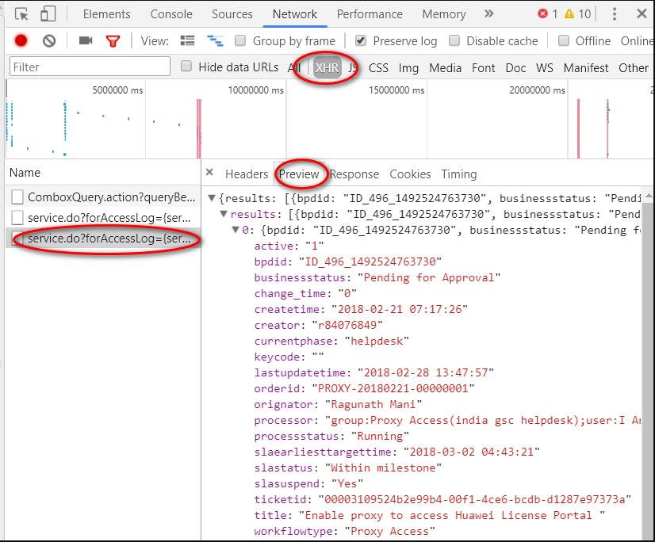

# Python 网络爬虫

### Python实现单点登录(SSO)

CAS协议流程:

第1步: 浏览器正常发起Web服务请求(带过期cookie或者无cookie)

第2步: web服务发现cookie无效, 重定向请求到CAS登录界面进行认证

第3步: 用户填写认证信息后, 将认证信息POST给CAS服务器

第4步: CAS服务器判定认证信息有效, 生成一个Cas-cookie, 并返回一个一次性有效ticket

第5步: 浏览器存储cas-cookie, 并带上ticket再次访问web服务

第6步: web服务会请求CAS服务器以验证ticket有效

第7步: CAS验证ticket有效后CAS即删除ticket, 返回结果给web服务

第8步: web服务生成一个service-cookie, 并返回web资源给浏览器

1. 分析网页

使用Chrome浏览器打开登录页面, 右键-\>检查, 打开分析工具, 在Network选卡上可以看到当前浏览器显示页面和提交登录信息的详情



输入账号密码, 点击登录, 当我们点击登录的时候, 因为我们还没有登录过, SSO会把我们自动重定向到登录页面, 所以http status是302重定向

从分析可以看到, 登录按钮提交的时候会用POST方式提交一个表格, 而表格里面的除了账号密码等显眼的字段以外还有一个lt, 经验告诉我们这个字段应该隐藏在之前的登录页面上, 用来校验登录页面的合法性, 所以我们要从登录页面上找到并提取这个信息. 同时还要注意http的消息头, 最好按照浏览器抓取的消息头去构造, 因为网站同样会校验这里面的信息.



实现代码:

```Python
import os
import sys
import time
import json
import requests
import urllib3
from lxml import etree

urllib3.disable_warnings(urllib3.exceptions.InsecureRequestWarning)

sess = requests.session()
sess.trust_env = False     # faster
cookie = None

header = {'User-Agent': 'Mozilla/5.0 (Windows NT 10.0; Win64; x64) AppleWebKit/537.36 (KHTML, like Gecko) Chrome/55.0.2883.87 Safari/537.36',
          'Accept': 'text/html,application/xhtml+xml,application/xml;q=0.9,image/webp,*/*;q=0.8',
          'Origin': 'https://<webaddr>',
          'Connection': 'keep-alive',
          'Content-Type': 'application/x-www-form-urlencoded'
}

def login_build():
    global cookie

    # 这里的URL为登录链接中service=后面的链接, 即登录后的URL, 也是APP的实际地址
    url = 'http://<serveraddr>/ngcf_build/servlet/5gnrindex'
    form_data = {
    	"username": "<username>",
    	"password": "<password>",
    	"submit": "",
    	"_eventId": "submit"
    }
    
    res = sess.get(url, headers=header, verify=False)  #通过实际地址获取cookie, lt参数和实际的登录地址; 直接通过实际地址无法登录, 这里需要先获取cookie, lt参数才能登陆成功
    cookie = res.cookies
    login_url = res.url  #这里获取到的URL才是浏览器中输入的登录URL, 即登录前, 输入APP实际地址后跳转到的登录地址, 就是网页中302重定向的地址

    header['Referer'] = login_url
    header['Cookie'] = 'JSESSIONID=' + cookie['JSESSIONID']
    form_data['lt'] = str(etree.HTML(res.content).xpath('//input[@name="lt"]/@value')[0])

    res = sess.post(login_url, headers=header, params=form_data, cookies=cookie, allow_redirects=False, verify=False)
    cookie = res.cookies

    res = sess.send(res.next, allow_redirects=False, verify=False)
    cookie = res.cookies

    if res.status_code == 200 or res.status_code == 302:
        if cookie is not None and cookie.get(name='JSESSIONID') is not None :
            print('Login succeeded')
            return 0
        else:
            print('Login failed')
            return 1

    return 1

def get_image_link():
    url = 'http://<serveraddr>/ngcf_build/servlet/dailyBuild'
    form_data = {
    	"start": "0",
    	"limit": "15",
    	"type": "query",
    	"queryBean.treeName": "5g-build-platform",
    	"queryBean.branchName": "master",
    	"queryBean.product": "bbu_bb_x86_64",
    	"queryBean.buildTypeId": "",
    	"queryBean.buildType": "",
    	"queryBean.buildDate": "",
    	"queryBean.queryStartTime": "{}T00:00:00".format(time.strftime('%Y-%m-%d')),
    	"queryBean.queryEndTime": "",
    	"queryBean.result": "",
    	"queryBean.errorMsg": "",
    	"queryBean.host": "",
    	"queryBean.taskAttr": "",
    	"queryBean.owner": "",
    	"queryBean.sort": "id",
    	"queryBean.dir": "desc",
    	"queryBean.start": "0",
    	"queryBean.limit": "15"
    }

    res = sess.post(url, data)
    result = str(res.content, 'utf-8')
    res_datas = json.loads(result)
    print(res_datas)
    compile_list = res_datas['list']
    for compile_info in compile_list:
        if 'debug' in compile_info['buildTypeShow'] and compile_info['result'] == '[success]':
            url_image = compile_info['outputUrl'] + '/image.tar.bz2'
            print('Image url: {}'.format(url_image))
            return url_image
    
    raise Exception('Get image failed')
```

这里要特别注意一点, 因为http是无状态的, web页面要保存登录状态需要用到cookie, 等成成功以后页面的response里面会包含一个带有有效标记的cookie, 登录最终的目标就是获取并保存这个有效的cookie, 这样后续的访问就不会被重定向到登录页.

在requests的方法里面只要向这样吧cookie带到请求里即可

### 对于Python2.7接口稍微有点变化

```Python
# -*- coding: utf-8 -*-

import os
import sys
import time
import json
import traceback
import requests
import urllib3
from sshlib import sshlib
from lxml import etree

sess = requests.session()
sess.trust_env = False     # faster
cookie = None

header = {'User-Agent': 'Mozilla/5.0 (Windows NT 10.0; Win64; x64) AppleWebKit/537.36 (KHTML, like Gecko) Chrome/55.0.2883.87 Safari/537.36',
          'Accept': 'text/html,application/xhtml+xml,application/xml;q=0.9,image/webp,*/*;q=0.8',
          'Origin': 'https://yfsso.ruijie.com.cn:8443',
          'Connection': 'keep-alive',
          'Content-Type': 'application/x-www-form-urlencoded'
}

def login_build():
    global cookie

    url = 'http://build.ruijie.net:8080/ngcf_build/servlet/5gnrindex'
    form_data = {
        "username": "goujunping",
        "password": "gjp71016",
        "submit": "",
        "_eventId": "submit"
    }
    
    res = sess.get(url, headers=header, verify=False)
    cookie = res.cookies
    login_url = res.url

    header['Referer'] = login_url
    header['Cookie'] = 'JSESSIONID=' + cookie['JSESSIONID']
    form_data['lt'] = str(etree.HTML(res.content).xpath('//input[@name="lt"]/@value')[0])

    res = sess.post(login_url, headers=header, params=form_data, cookies=cookie, allow_redirects=False, verify=False)
    cookie = res.cookies

    url_with_ticket = res.headers['location']
    res = sess.get(url=url_with_ticket, allow_redirects=False, verify=False)
    cookie = res.cookies

    if res.status_code == 200 or res.status_code == 302:
        if cookie is not None and cookie.get(name='JSESSIONID') is not None:
            print('Login succeeded')
            return 0

    print('Login failed')
    return 1
```

参考: https://blog.csdn.net/zhutou_xu/article/details/114212377

### 分析动态内容页面

在动态页面里, 页面上显示出来的内容往往都是js或者AJAX异步获取到的, 跟静态html页面的分析过程有明显的不同. 用Chrome的分析工具也可以很容易的获取到该信息. 



在动态页面加载完成后, 我们从所有的请求中过滤XHR类型, 从中找到我们要的那一次请求, 然后在该请求的Preview里面就可以看到完整的相应信息, 同时该请求的URL也可以从Headers选卡中得到.

接下来要做的事情跟上面类似, 构造报文模拟浏览器向该网站发送请求:

```Python
def get_content(order_id):
    form_data = {
        'roarand': 'BW09el5W3mW2sfbGbtWe7mWlwBsWqXg6znppnqkW3woJ5fcz5DnhfWXGonqkLsd0',
        'start': '0',
        'limit': '20',
        'orderid': order_id,
        'serviceId': 'test_gscsocsecurityincidentmanage_log_getList2'
    }

    header = {
        'Accept': 'text/plain, */*; q=0.01',
        'Accept-Encoding': 'gzip, deflate, br',
        'Accept-Language': 'zh-CN,zh;q=0.9,en;q=0.8',
        'Connection': 'keep-alive',
        'Content-Type': 'application/x-www-form-urlencoded;charset=UTF-8',
        'Host': '<your web>.com',
        'Origin': 'https://<your web>.com',
        'Referer': 'https://<your web>.com/app/104h/spl/test/ID_480_1511441539904_workflowdetail.spl?orderid=SOC-20180220-00000003',
        'User-Agent': 'Mozilla/5.0 (Windows NT 10.0; Win64; x64) AppleWebKit/537.36 (KHTML, like Gecko) Chrome/63.0.3239.132 Safari/537.36',
        'X-Requested-With': 'XMLHttpRequest'
    }
    print('Start to scan order id ' + order_id)

    url = 'https://<your web>.com/app/pageservices/service.do?forAccessLog={serviceName:test_gscsocsecurityincidentmanage_log_getList2,userId:571bdd42-10ca-4ce1-b41c-8a3f6632141f,tenantId:104h}&trackId=fec68f8e-f30a-4fa1-a8b1-41d3dd11fa4c'
    res = s.post(url, headers=header, params=form_data, cookies=cookie, allow_redirects=False, verify=False) #要加载上面登录成功的cookie
    print(res.content)
    return res
```

要点其实就是从XHR里找到请求的URI, 构造请求报文头和提交表格, 最后务必要加上登录成功的cookie, 否则会被重定向到登录页面.

抓取动态页面的方法还有很多, 这种方法依赖的包相对较少, 代码比较灵活, 在爬取复杂的登录页面的时候效果比较好, 只是在分析页面登录机制的时候要尤其细心.

参考:

https://www.jianshu.com/p/8cd6e9bc2680