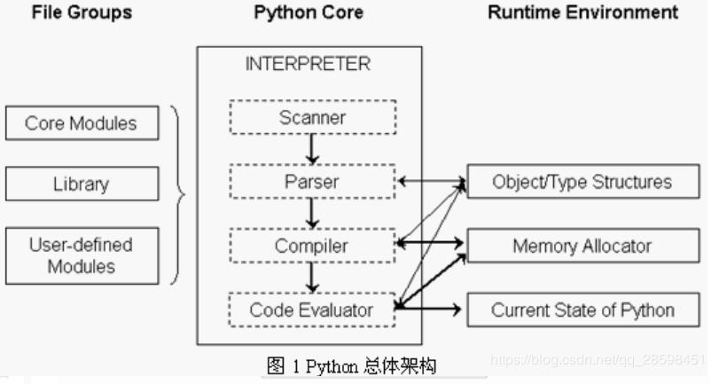

Python 源代码学习(3.7.5)
====================================

第一章: Python 总体架构
-----------------------------

**1. Python 总体架构**

| 下图是Python的总体架构：

| 右边是Python的运行环境, 包括对象/类型系统(Object/Type structures), 内存分配
| 器(Memory Allocator)和运行时状态信息(Current State of Python). 运行时状态维
| 护了解释器在执行字节码时不同的状态(比如正常状态和异常状态)之间切换的动作. 
| 内存分配器则全权负责Python中创建对象时, 对内存的申请工作, 实际上它就是
| Python运行时与C中malloc的一层接口。而对象/类型系统则包含了Python中存在
| 的各种内建对象, 比如整数, list和dict, 以及各种用户自定义的类型和对象.

| 中间部分是Python的核心 -- 解释器(interpreter), 或者称为虚拟机. 在解析器中, 箭
| 头的方向指示了Python运行过程中的数据流方向. 其中Scanner对应词法分析, 将文
| 件输入的Python源代码或从命令行输入的一行行Python代码切分为一个个的token;
| Parser对应语法分析, 在Scanner的分析结果上进行语法分析, 建立抽象语法树(AST); 
| Compiler是根据建立的AST生成指令集合 -- Python字节码(byte code), 就像Java编译
| 器和C#编译器所做的那样; 最后由Code Evaluator来执行这些字节码. 因此Code 
| Evaluator又可以被称为虚拟机

| 图中, 在解释器与右边的对象/类型系统, 内存分配器之间的箭头表示"使用"关系; 而与
| 运行时状态之间的箭头表示"修改"关系, 即Python在执行的过程中会不断地修改当前解
| 释器所处的状态, 在不同的状态之间切换

**2. Python源代码的组织**

| 下图是Python的目录结构:

.. image:: images/PythonSourceCode/0-2.jpeg

| Include: 该目录下包含了Python提供的所有头文件, 如果用户需要自己用C或C++来编写
| 自定义模块扩展Python, 那么就需要到这里提供头文件

| Lib: 该目录包含了Python自带的所有标准库, Lib中的库都是用Python语言编写的

| Modules: 该目录中包含了所有用C语言编写的模块, 比如random, cStringIO等. Modules
| 中的模块是那些对速度要求非常严格的模块, 而有一些对速度没有太严格要求的模块, 就
| 是用Python编写的, 放在Lib目录下, 比如os

| Parser: 该目录中包含了Python解释器中的Scanner和Parser部分, 即对Python源代码进行
| 词法分析和语法分析的部分. 除了这些, Parser目录下还包含了一些有用的工具, 这些工
| 具能够根据Python语言的语法自动生成Python语言的词法和语法分析器, 与YACC非常类型.

| Objects: 该目录包含了所有Python的内建对象, 包括整数, list, dict等. 同时, 该目录
| 还包括了Python在运行时需要的所有的内部使用对象的实现

| Python: 该目录下包含了Python解释器中的Compiler和执行引擎部分, 时Python运行的核心
| 所在

| PCBuild: 包含了Visual Studio的工程文件

第二章: Python 对象初探
-----------------------------

**1. 对象机制的基石 -- PyObject**

| 在Python中, 对象就是为C中的结构体在堆上申请的一块内存, 一般来说, 对象是不能被静态
| 初始化的, 并且也不能在栈空间上生存. 唯一的例外就是类型对象, Python中所有的内建对
| 象(如整数类型对象, 字符串类型对象)都是被静态初始化的.

| 在Python中, 一个对象一旦被创建, 它在内存中的大小就是不变的了. 这就意味着需要容纳
| 可变长度数据的对象只能在对象内维护一个指向一块可变大小的内存区域的指针.

| 在Python中, 所有的东西都是对象, 而所有的对象都拥有一些相同的内容, 这些内容在PyObject
| 中定义, PyObject是整个Python对象机制的核心

.. code::

    [Include/object.h]
    typedef struct _object {
        _PyObject_HEAD_EXTRA
        Py_ssize_t ob_refcnt;
        struct _typeobject *ob_type;
    } PyObject;

| 从代码中可以看到, Python对象的密码都隐藏在_PyObject_HEAD_EXTRA这个宏中

.. code::

    [Include/object.h]
    #ifdef Py_TRACE_REFS
    /* Define pointers to support a doubly-linked list of all live heap objects. */
    #define _PyObject_HEAD_EXTRA            \
        struct _object *_ob_next;           \
        struct _object *_ob_prev;

    #define _PyObject_EXTRA_INIT 0, 0,

    #else
    #define _PyObject_HEAD_EXTRA
    #define _PyObject_EXTRA_INIT
    #endif

| 当我们在Visual Studio的release模式下编译Python时, 是不会定义Py_TRACE_REFS符号的.
| 所以在实际发布的Python版本中, PyObject的定义非常简单

.. code::
    [Include/object.h]
    typedef struct _object {
        Py_ssize_t ob_refcnt;
        struct _typeobject *ob_type;
    } PyObject;

| 其中变量ob_refcnt实际上是一个整形, 与Python的内存管理机制有关, 它实现了基于引用计
| 数的垃圾收集机制. 对于某一个对象A, 当有一个新的PyObject *引用该对象时, A的引用计数
| 应该增加; 而当这个PyObject *被删除时, A的引用计数应该减少. 当A的引用计数减少到0时,
| A就可以从堆上被删除, 以释放出内存供别的对象使用.

| ob_type是一个指向_typeobject结构体的指针, 这个结构体是用来指定一个对象类型的类型对象

| 可以看出, 在Python中, 对象机制的核心其实就是一个引用计数和一个类型信息

| 在PyObject中定义了每一个Python对象都必须有的内容, 这些内容将出现在每一个Python对象所
| 占有的内存的最开始的字节中; 其后才是每个对象区别于其他对象的特殊信息

**2. 定长对象和变长对象**

| 整数对象这样不包含可变长度数据的对象称为定长对象, 而字符串对象这样包含可变长度数据
| 的对象称为变长对象. 它们的区别在于定长对象的不同对象占用的内存大小一样, 而变长对象
| 的不同对象占用的内存可能是不一样的.

| 以下PyVarObject是变长对象的定义: 实际上是在PyObject后面增加了一个ob_size的成员, 它
| 用来指明变长对象中一共容纳了多少个元素. **它是元素的个数, 而不是字节的数量**. 比如list
| 对象就是一个PyVarObject对象, 如果某一时刻, 这个list中有5个元素, 那么ob_size的值就是5.

.. code::

    [Include/object.h]
    typedef struct {
        PyObject ob_base;
        Py_ssize_t ob_size; /* Number of items in variable part */
    } PyVarObject;

| 因此, 对于任何一个PyVarObject, 其所占用的内存, 开始部分的字节的意义和PyObject是一样的.
| 即在Python内部, 每一个对象都拥有相同的对象头部. 这就使得在Python中, 对对象的引用变得非
| 常的统一, 我们只需要用一个PyObject *指针就可以引用任意的一个对象, 而不论该对象实际是一
| 个什么对象.

| 下图显示了Python中不同对象与PyObject, PyVarObject在内存布局上的关系:

.. image:: images/PythonSourceCode/1-1.jpeg

**3. 类型对象**

.. code::

    [Include/object.h]
    /* PyObject_VAR_HEAD defines the initial segment of all variable-size
     * container objects.  These end with a declaration of an array with 1
     * element, but enough space is malloc'ed so that the array actually
     * has room for ob_size elements.  Note that ob_size is an element count,
     * not necessarily a byte count.
     */
    #define PyObject_VAR_HEAD      PyVarObject ob_base;

.. code::

    [Include/object.h]
    #ifdef Py_LIMITED_API
    typedef struct _typeobject PyTypeObject; /* opaque */
    #else
    typedef struct _typeobject {
        PyObject_VAR_HEAD
        const char *tp_name; /* For printing, in format "<module>.<name>" */
        Py_ssize_t tp_basicsize, tp_itemsize; /* For allocation */

        /* Methods to implement standard operations */

        destructor tp_dealloc;
        printfunc tp_print;
        getattrfunc tp_getattr;
        setattrfunc tp_setattr;
        PyAsyncMethods *tp_as_async; /* formerly known as tp_compare (Python 2)
                                        or tp_reserved (Python 3) */
        reprfunc tp_repr;

        /* Method suites for standard classes */

        PyNumberMethods *tp_as_number;
        PySequenceMethods *tp_as_sequence;
        PyMappingMethods *tp_as_mapping;

        /* More standard operations (here for binary compatibility) */

        hashfunc tp_hash;
        ternaryfunc tp_call;
        reprfunc tp_str;
        getattrofunc tp_getattro;
        setattrofunc tp_setattro;

        /* Functions to access object as input/output buffer */
        PyBufferProcs *tp_as_buffer;

        /* Flags to define presence of optional/expanded features */
        unsigned long tp_flags;

        const char *tp_doc; /* Documentation string */

        /* Assigned meaning in release 2.0 */
        /* call function for all accessible objects */
        traverseproc tp_traverse;

        /* delete references to contained objects */
        inquiry tp_clear;

        /* Assigned meaning in release 2.1 */
        /* rich comparisons */
        richcmpfunc tp_richcompare;

        /* weak reference enabler */
        Py_ssize_t tp_weaklistoffset;

        /* Iterators */
        getiterfunc tp_iter;
        iternextfunc tp_iternext;

        /* Attribute descriptor and subclassing stuff */
        struct PyMethodDef *tp_methods;
        struct PyMemberDef *tp_members;
        struct PyGetSetDef *tp_getset;
        struct _typeobject *tp_base;
        PyObject *tp_dict;
        descrgetfunc tp_descr_get;
        descrsetfunc tp_descr_set;
        Py_ssize_t tp_dictoffset;
        initproc tp_init;
        allocfunc tp_alloc;
        newfunc tp_new;
        freefunc tp_free; /* Low-level free-memory routine */
        inquiry tp_is_gc; /* For PyObject_IS_GC */
        PyObject *tp_bases;
        PyObject *tp_mro; /* method resolution order */
        PyObject *tp_cache;
        PyObject *tp_subclasses;
        PyObject *tp_weaklist;
        destructor tp_del;

        /* Type attribute cache version tag. Added in version 2.6 */
        unsigned int tp_version_tag;

        destructor tp_finalize;

    #ifdef COUNT_ALLOCS
        /* these must be last and never explicitly initialized */
        Py_ssize_t tp_allocs;
        Py_ssize_t tp_frees;
        Py_ssize_t tp_maxalloc;
        struct _typeobject *tp_prev;
        struct _typeobject *tp_next;
    #endif
    } PyTypeObject;
    #endif

| 可以看出来, 类型对象最前面是一个PyObject_VAR_HEAD, 实际上就是一个可变长度对象的头部, 
| 分别包含引用计数, 类型指针, 元素个数; 其后的信息是与对象所属类型密切相关的一些信息.

| tp_name - 类型名, 主要是Python内部以及调试的时候使用
| tp_basicsize, tp_itemsize - 创建该类型对象时分配内存空间大小的信息
| 与该类型相关的操作信息, 比如tp_print

| 事实上, 一个PyTypeObject对象就是Python中对面向对象理论中"类"这个概念的实现.

