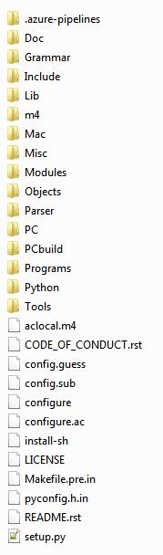

Python 源代码学习(3.7.5)
====================================

第一章: Python 总体架构
-----------------------------

**1. Python 总体架构**

| 下图是Python的总体架构：

| 右边是Python的运行环境, 包括对象/类型系统(Object/Type structures), 内存分配
| 器(Memory Allocator)和运行时状态信息(Current State of Python). 运行时状态维
| 护了解释器在执行字节码时不同的状态(比如正常状态和异常状态)之间切换的动作. 
| 内存分配器则全权负责Python中创建对象时, 对内存的申请工作, 实际上它就是
| Python运行时与C中malloc的一层接口。而对象/类型系统则包含了Python中存在
| 的各种内建对象, 比如整数, list和dict, 以及各种用户自定义的类型和对象.

| 中间部分是Python的核心 -- 解释器(interpreter), 或者称为虚拟机. 在解析器中, 箭
| 头的方向指示了Python运行过程中的数据流方向. 其中Scanner对应词法分析, 将文
| 件输入的Python源代码或从命令行输入的一行行Python代码切分为一个个的token;
| Parser对应语法分析, 在Scanner的分析结果上进行语法分析, 建立抽象语法树(AST); 
| Compiler是根据建立的AST生成指令集合 -- Python字节码(byte code), 就像Java编译
| 器和C#编译器所做的那样; 最后由Code Evaluator来执行这些字节码. 因此Code 
| Evaluator又可以被称为虚拟机

| 图中, 在解释器与右边的对象/类型系统, 内存分配器之间的箭头表示"使用"关系; 而与
| 运行时状态之间的箭头表示"修改"关系, 即Python在执行的过程中会不断地修改当前解
| 释器所处的状态, 在不同的状态之间切换

.. image:: images/0-1.jpeg

**2. Python源代码的组织**

| 下图是Python的目录结构:

| Include: 该目录下包含了Python提供的所有头文件, 如果用户需要自己用C或C++来编写
| 自定义模块扩展Python, 那么就需要到这里提供头文件

| Lib: 该目录包含了Python自带的所有标准库, Lib中的库都是用Python语言编写的

| Modules: 该目录中包含了所有用C语言编写的模块, 比如random, cStringIO等. Modules
| 中的模块是那些对速度要求非常严格的模块, 而有一些对速度没有太严格要求的模块, 就
| 是用Python编写的, 放在Lib目录下, 比如os

| Parser: 该目录中包含了Python解释器中的Scanner和Parser部分, 即对Python源代码进行
| 词法分析和语法分析的部分. 除了这些, Parser目录下还包含了一些有用的工具, 这些工
| 具能够根据Python语言的语法自动生成Python语言的词法和语法分析器, 与YACC非常类型.

| Objects: 该目录包含了所有Python的内建对象, 包括整数, list, dict等. 同时, 该目录
| 还包括了Python在运行时需要的所有的内部使用对象的实现

| Python: 该目录下包含了Python解释器中的Compiler和执行引擎部分, 时Python运行的核心
| 所在

| PCBuild: 包含了Visual Studio的工程文件

第二章: Python 对象初探
-----------------------------

| 在Python中, 对象就是为C中的结构体在堆上申请的一块内存, 一般来说, 对象是不能被静态
| 初始化的, 并且也不能在栈空间上生存. 唯一的例外就是类型对象, Python中所有的内建对
| 象(如整数类型对象, 字符串类型对象)都是被静态初始化的.

| 在Python中, 一个对象一旦被创建, 它在内存中的大小就是不变的了. 这就意味着需要容纳
| 可变长度数据的对象只能在对象内维护一个指向一块可变大小的内存区域的指针.

| 在Python中, 所有的东西都是对象, 而所有的对象都拥有一些相同的内容, 这些内容在PyObject
| 中定义, PyObject是整个Python对象机制的核心

.. code::

    [Include/object.h]
    typedef struct _object {
        _PyObject_HEAD_EXTRA
        Py_ssize_t ob_refcnt;
        struct _typeobject *ob_type;
    } PyObject;

