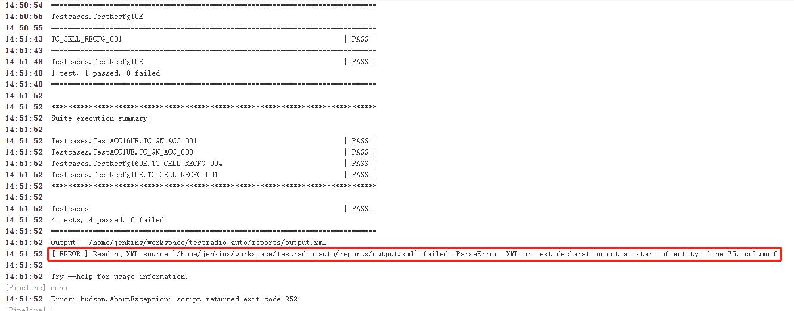
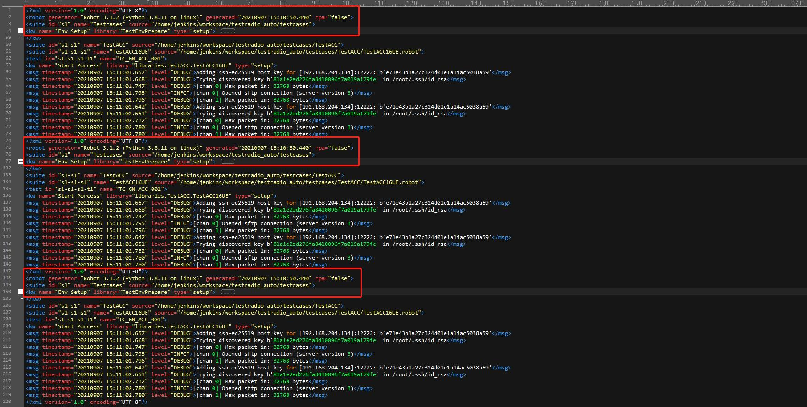
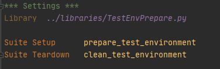
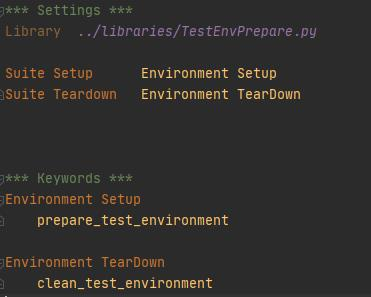

# RobotFramework测试框架

## RIDE环境搭建

### 安装RIDE

```Shell
pip install robotframework-ride
```

中文文档:
https://robotframework-userguide-cn.readthedocs.io/zh_CN/latest/index.html


### 通过RF API执行用例

```Python
from robot.api import TestSuiteBuilder
from robot.api import ResultWriter

# testcases为测试用例目录, 跟当前文件在同一级目录下
suite = TestSuiteBuilder().build('testcases')
# 设置要测试的tests, suite, tag等, 默认为None, 测试所有的用例; 函数原型为filter(included_suites=None, included_tests=None, included_tags=None, excluded_tags=None)
suite.filter(included_tests=args['--test'], included_tags=args['--include'])
# 开始执行测试用例, 里面的参数跟命令行参数基本相同, 其中listener参数指定的文件好像需要用绝对路径; variable参数如果有多个的话, 需要用列表形式variable=[’VAR1:value1’, ’VAR2:value2’], 单个的话可以用字符串形式variable=’VAR:value’
result = suite.run(loglevel='DEBUG', outputdir=report_path, listener=args['--listener'], pythonpath=args['--pythonpath'], variable=args['--variable'])
# 写HTML报告
ResultWriter(result).write_results(report=os.path.join(report_path, 'report.html'), log=os.path.join(report_path, 'log.html'))
```

### output.xml中重复出现**\<?xml version="1.0" encoding="UTF-8"?\>**内容

现象:

在Linux服务器上跑完测试后在生成log.html和report.html的时候失败, 出现以下错误:

**\[ ERROR \] Reading XML source '/home/jenkins/workspace/testradio_auto/reports/output.xml' failed: ParseError: XML or text declaration not at start of entity: line 75, column 0**



奇怪的是该问题只Windows中不会出现

对比了Windows和Linux的版本信息: Windows上Python为3.8.9, RobotFramework为4.0.3; Linux上Python为3.8.11, RobotFramework为4.1; 但是尝试将两个环境安装相同版本后, 问题仍然存在, 排除版本问题

然后根据错误信息查看output.xml文件, 发现前面重复出现了4个**\<?xml version="1.0" encoding="UTF-8"?\>**从而导致了解析失败(这里出现4次可能正好我的测试用例里面有4个suite, 即4个测试文件), 

而该日志后面连续4段日志都是__init__.robot中初始化操作的日志



开始以为是初始化函数执行了4次, 然后通过增加日打印发现实际上只执行了一次, 并且查看output.xml中的时间戳, 前面4部分的时间戳都是相同的, 则说明不可能执行了4次

最后修改了__init__.robot文件中的实现方式, 问题解决

修改前



修改后



其中prepare_test_environment和clean_test_environment函数都是在TestEnvPrepare.py文件中用Python脚本实现的

修改前是直接在Suite Setup和Suite Teardown关键字后面指定Python的函数, 这种情况下在Linux环境中就会出现重复日志的情况

修改后是在__init__.robot中将Python函数分别封装成robotframework的keyword, 然后再调用封装后的keyword, 则问题解决

具体原因不知道

后来发现这样修改后, 问题仍然存在, 先记录
